# Lab - Basic Switch and Host Connectivity

## General

This lab demonstrates the basic configuration of Layer 2 switch management and end-device connectivity using a simulation from Cisco Packet Tracer.

The main objective of this lab was to configure two switches and two PCs on the same IPv4 network, assign management IP addresses to the switches via an SVI, and verify end-to-end connectivity using ICMP ping tests.

`It is also possible to look in the .txt folder the commands found in the images, to assist the process for anyone reading this repository.`

Objectives:

- Configure hostnames on Cisco switches

- Configure management IP addresses using SVIs from VLAN 1

- Assign IPv4 addresses to end devices

- Save switch configurations to NVRAM

- Verify interface status and IP configuration

- Test connectivity between hosts and switches using ICMP

- Validate that all devices can connect

## Basic Switch Configuration

First, to initially configure, it's important to show the addressing table that was used:

Now, the SVI configuration will occur in S1 and S2

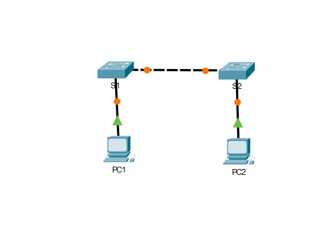

That is, in the first step, I will configure S1 with a hostname, so I will enter the CLI tab

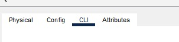

of S1 and enter the mode To create a privileged EXEC server, simply type as shown in the image below:

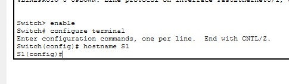

Now with the hostname established, I will configure S1 with an IP address. Still in global configuration mode, I will configure the IP address on VLAN 1 by writing `interface vlan 1` and consequently the IP address with its mask, as shown in the image below.

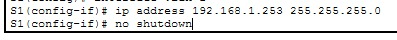

Now exiting configuration mode and saving the configuration so that everything is executed correctly.

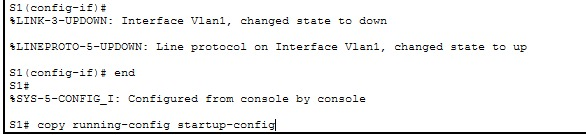

And thus verifying if the IP address on S1 appears correctly.

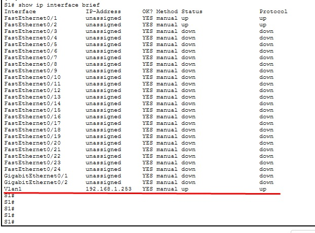

Now that S1 is correctly configured, the next step would be to reproduce the same configuration on S2, but according to the addressing table. The entire configuration record for S2 is below so that no information regarding this lab is left out:

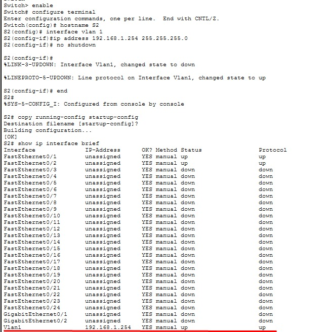

After that, the next step will be to configure both PCs with IP addresses. Going to the desktop tab of the first PC,

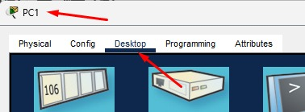

I will enter IP configuration. According to the addressing table, the coordinated IP address for PC1 is 192.168.1.1 and its mask is 255.255.255.0. By entering this information in the designated window, we can finalize the configuration, resulting in an exact result as illustrated in the image below:

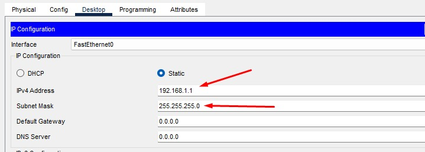

Without wasting time, I repeat the same process on the second computer according to the table.

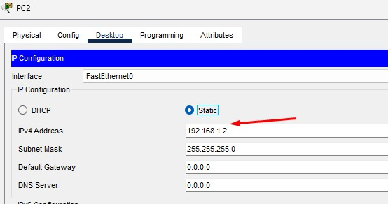

Now, checking if everything is working, I will verify the connectivity with the `ping` command to see if everything was successful.

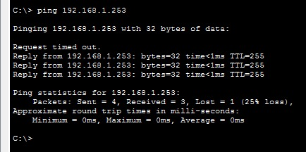

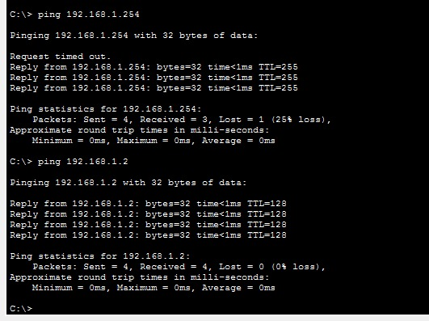

For those who want to replicate this lab, if the ping results in 80% on your machine, just try again until it results in 100%. It's very common for a ping to fail on the first try.

---

# Conclusion

Despite being a basic structure, this lab allows those studying networks to transform a theoretical concept into practice. Analyzing and configuring Cisco devices, assigning IPv4 addresses, and using an SVI reinforces fundamental concepts such as connectivity, ICMP, and others, thus forming an essential basis for troubleshooting and administering larger networks.