# Configuring a DHCP service

## Objective

My goal in this lab is to show how, in practice, I connected 3 computers to a wireless router and changed the DHCP configuration on a specific network, configuring the clients to obtain their addresses via DHCP.

---

Initially, with only the DHCP enabled router on the desktop.

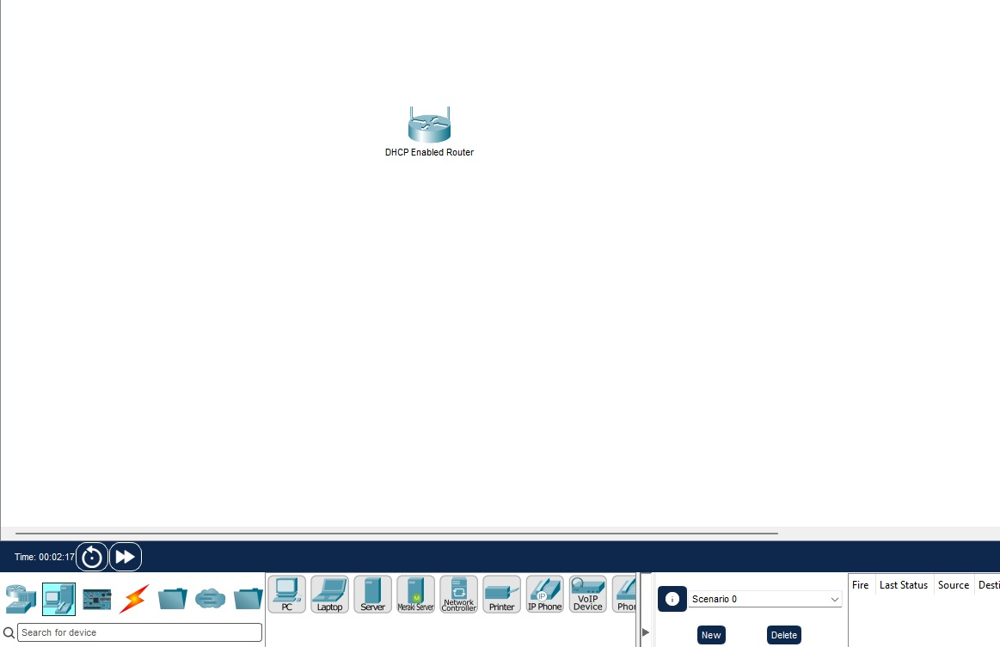 

I manually added three generic PCs.

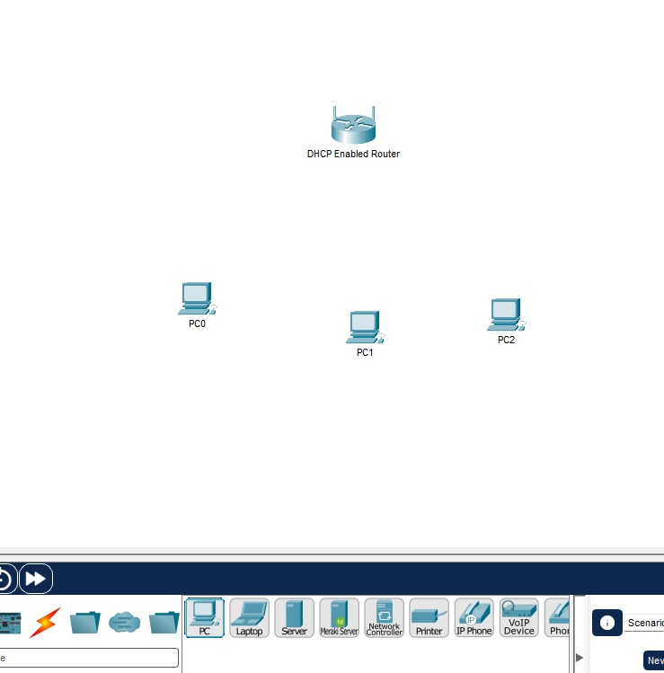 

Then I connected each one to an Ethernet port on a wireless router using straight cables.

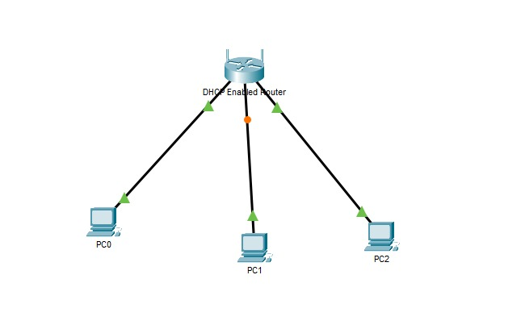 

After all the yellow lights turned green, I went to the first PC and in the Desktop tab, selected the IP configuration where I selected DHCP to receive an IP address from the router by clicking on `Enabled for DHCP`.

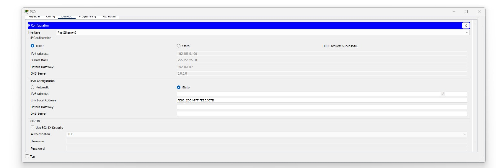

After that, I typed the registered default gateway IP address into the URL field in the web browser to open the `administrator panel` where it's possible to see the range of addresses available to clients.

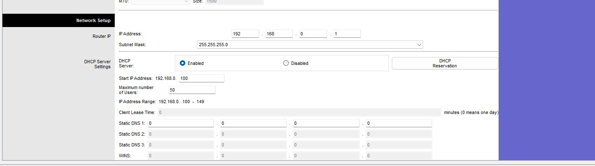 

where I changed the IP address to: `192.168.0.1 -> 192.168.5.1` and after saving the settings, I went back to the IP configuration to restore the new DHCP information and then change the default DHCP address range;

After that, I changed the IP address to `192.168.5.126` and changed the maximum number of users to `75`.

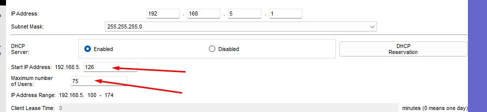 

Now, checking the IP Configuration, I can see the new changes:

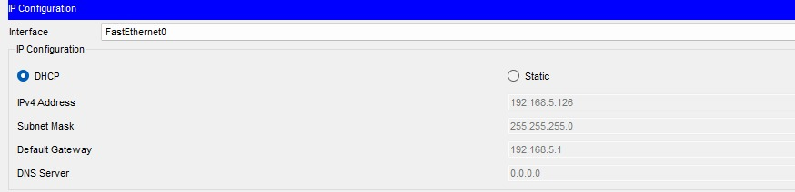 

And in this way, I also checked the IP and the rest of the settings through the PC's `command prompt` window and typed `ipconfig` as shown in the image below:

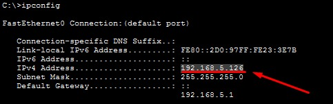 

On the second desktop, I already enabled DHCP instead of static in the IP configuration. 

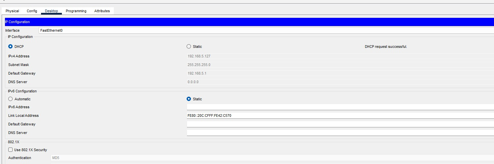 

and I did the same on the last desktop, following the same steps:

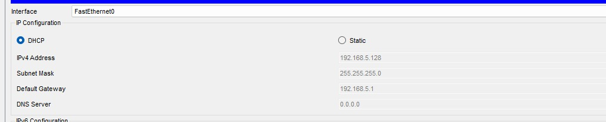 

and to finish, I did a quick check of its connectivity by opening the command prompt and typing `ipconfig` to view the IP address, just like I did before, and after that I typed `ping 192.168.5.1` to ping the wireless router:

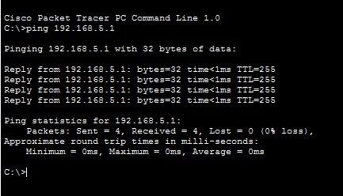 

I also pinged the first computer, executing `ping 192.168.5.126` as you can see in the image below:

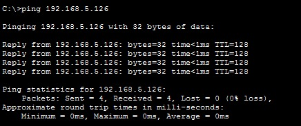 

And also the same on the second computer with the command `ping 192.168.5.127` as shown below:

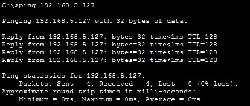 

---

## Conclusion

From a cybersecurity professional's perspective, this is important because analyzing network behavior requires understanding how devices typically obtain addresses and communicate. 
note: Incorrect DHCP configurations or unauthorized DHCP servers can cause connectivity issues or redirect network traffic.

The main takeaway from this lab is simple: to recognize abnormal network behavior, I first need to understand how the network normally behaves.

This lab helped me understand more about DHCP by configuring a network scenario and observing how clients automatically receive their network settings.

It also covered how to renew client addresses, inspect their settings with the ipconfig command, and verify connectivity using the ping command.