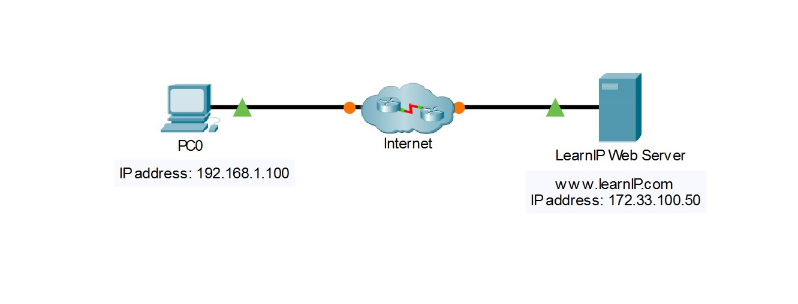
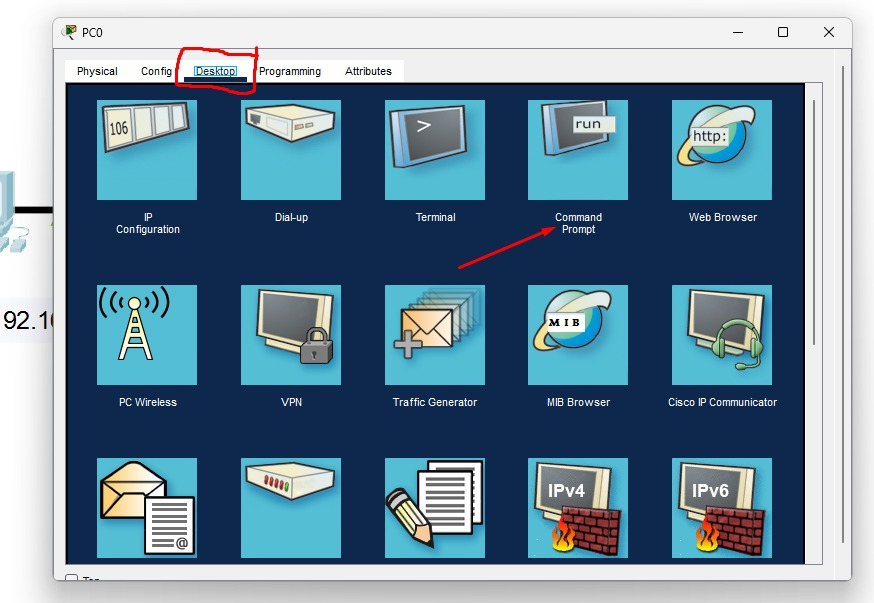
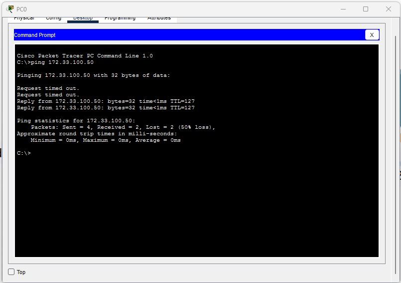
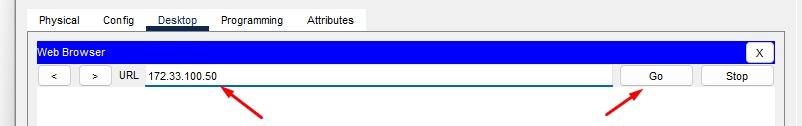
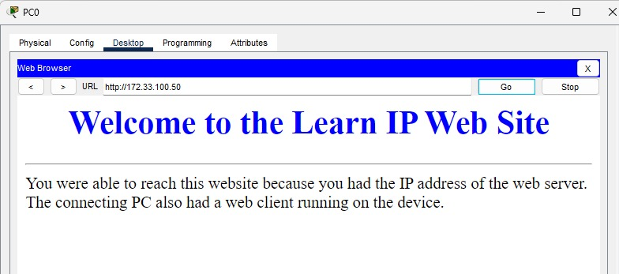

## Connect to a Web Server

This is a practical exercise based on the IPv4 addressing concepts covered in the network fundamentals module; my goal was to observe how packets are sent across the Internet using IP addresses and to document what I learned in this section.

### Part 1: Verify connectivity to the web server

I will select PC0 to verify its connectivity.

Next, by selecting the Desktop tab and Command Prompt, I typed `ping 172.33.100.50` to verify connectivity to the web server.

A reply verifies connectivity from the client to the destination web server.

### Part 2: Connect to the Web Server via the web client

By selecting the web browser on PC0, I entered the address `172.33.100.50` into the URL bar and clicked "Go," allowing the web client to connect to the web server using the IP address.

This successfully completes the task of accessing the web server.

---

## In Summary

Although it involves few steps, this exercise demonstrates how source and destination IPv4 addresses are used when a client attempts to communicate with a remote web server. From a technical perspective, I observed that the source IPv4 address identifies the sending host and the destination IPv4 address identifies the remote web server, allowing the packet to be forwarded across the network toward its destination.