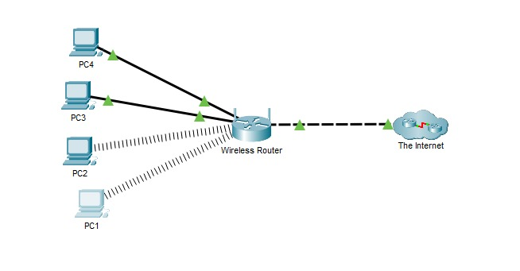
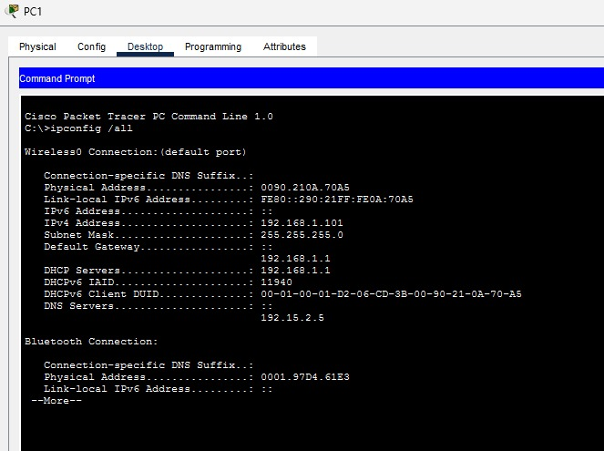
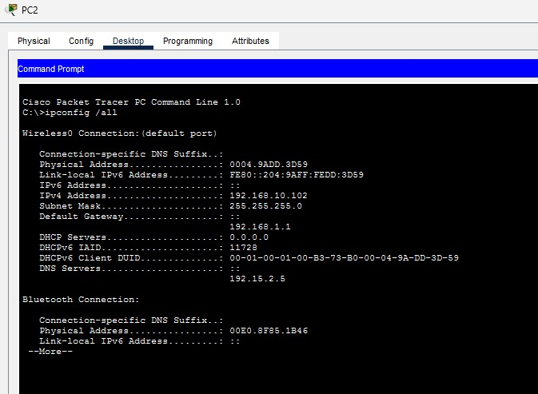
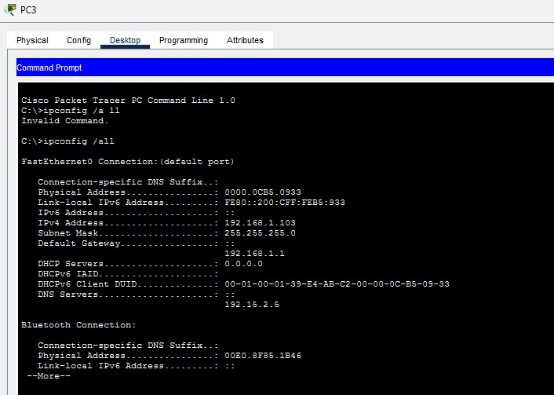
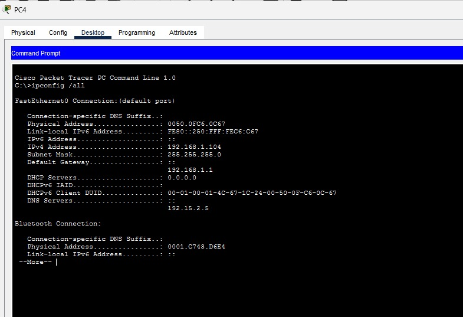
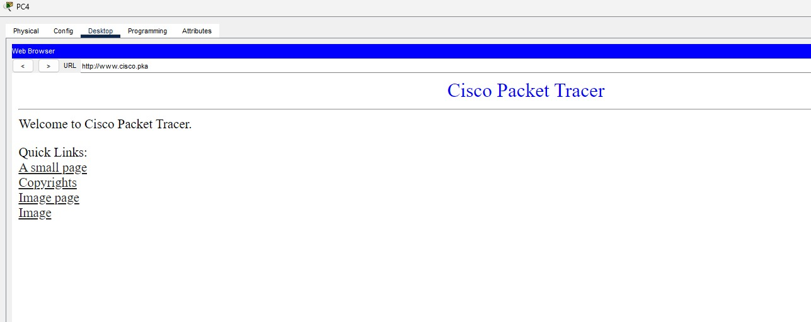
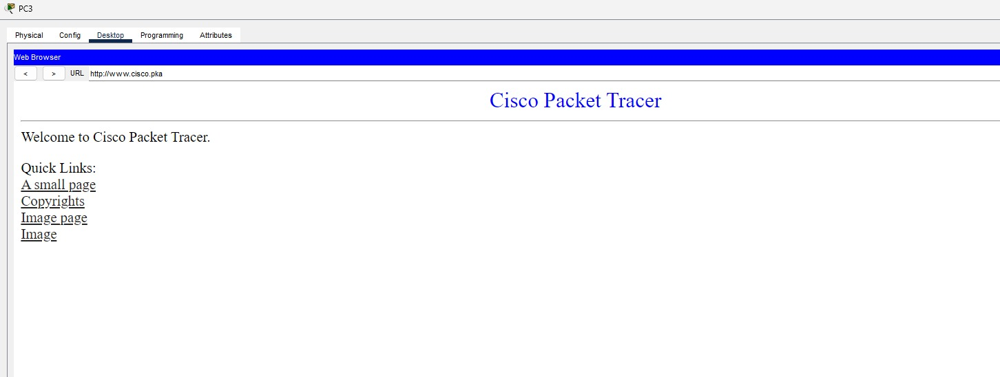
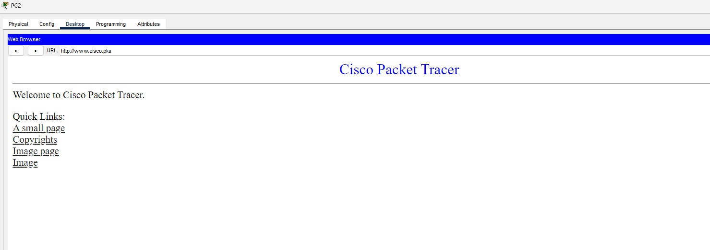

## IPCONFIG LAB - Introduction

In this lab, using a simulation within Cisco's own Packet Tracer, I will show how to use the `ipconfig` command to identify incorrect configurations on a PC and how to solve them.

### EXAMPLE SCENARIO

In this case, the simulation I am showing, to avoid being superficial, has been adapted so that it would happen in a company where I work, where an owner cannot connect to the internet with one of the four office computers. Therefore, it is important to know that the computers are configured with static IP addresses using the `192.168.1.0/24` network. The computers should be able to access the web server (www.cisco.pka.). Use the ipconfig /all command to identify which computer is incorrectly configured.

## Instructions on how to use

### 1 - Check the settings

Access the command prompt on each computer and type `ipconfig /all`

Examining the IP address, subnet mask, and default gateway configuration of each computer is important to remember to identify which one was incorrectly configured.

First computer:

Second computer:

Third computer:

Fourth computer:

Now that I have identified that computers 2, 3, and 4 were misconfigured, I will move to the next step. This was noticeable because only the first one had DHCP Server information and was the only one opening the link: (www.cisco.pka).

### 2 - Correct any Misconfigurations

Selecting computers 2, 3, and 4:

I select the Desktop tab and then IP configuration and select the option DHCP to automatically config. This is how I correct it. And so here are the solutions for those that weren't running yet:

---

### Conclusion

In this way, it becomes clear how such a simple, basic command can not only provide sufficient data from a machine but also, in the right hands, solve a very frequent problem in companies and business environments that are poorly configured.