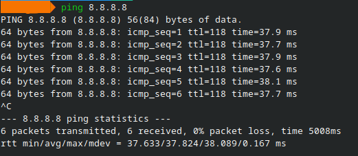
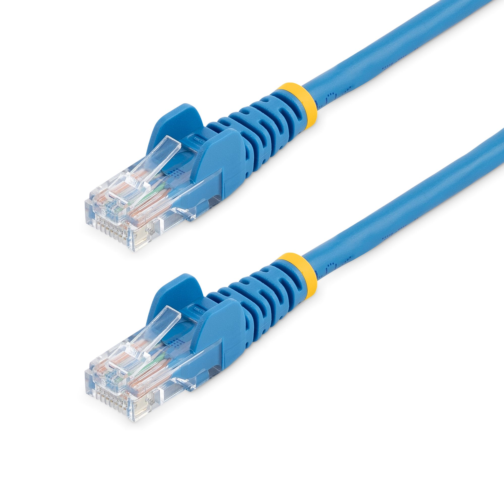
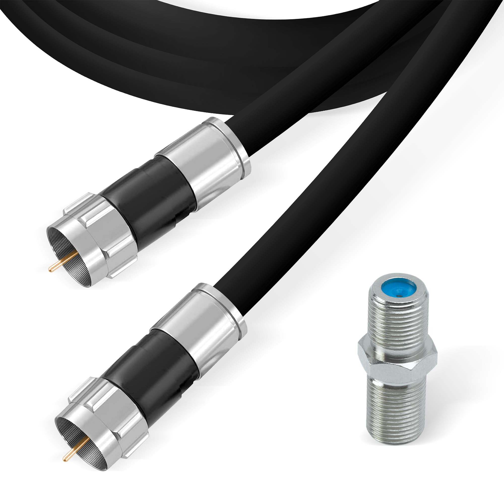
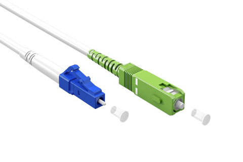
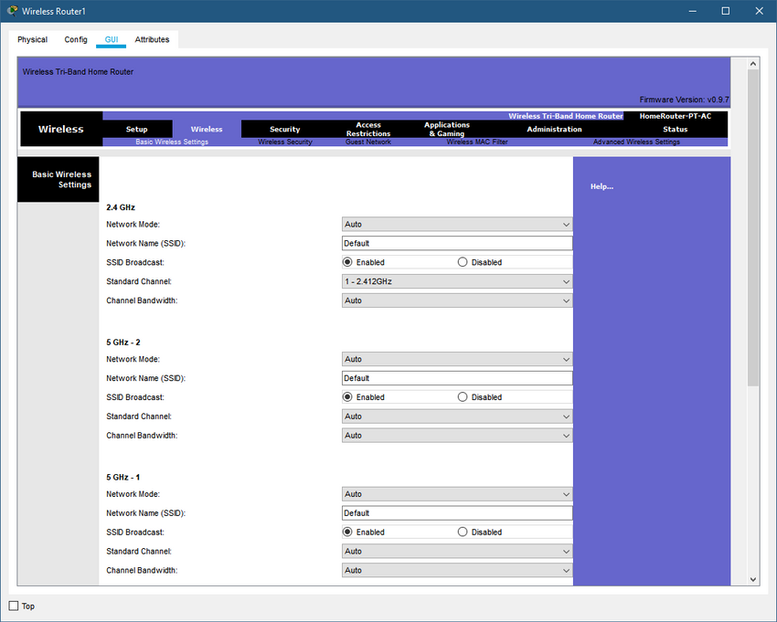

# Network Fundamentals

## Objective

Document my research and direct experience with the principles of computer networking.

## 1. Network Types

### What is a Network?

A computer network is a group of intercoonected devices that communicate and exchange data with each other

These devices are not just found in conventional computers. Contemporany networks may consist of:

Laptops and desktop computers,
Tablets and smartphones,
Servers,
Gaming Consoles and Smart TVs,
Security Cameras,
Smart Home gadgets,
RFID systems and sensors,
Automobile and Internet of Things devices,

Networks can connect dozens or even millions of devices, or they can be incredibly small, like a few gadgets in a house.

### The Internet. What it is?

The Internet is decentralized system made up of many interconnected networks operated by different companies, organizations, governments and individuals.

Furthermore, it is an huge collections of separate networks that use common networking standards and protocols to communicate with one another.

a condensed illustation.

My Laptop (WIFI) -> Home Router -> ISP Network -> Internet -> Remote Network -> Web Server

In this example, my device interacts across several networks when I visit a website in order to get to the server providing the desired service. Therefore, data can dravel between these networks using different transmissions technologies, For example:

Copper cables
Fiber-optic cables
wireless communication
Sattelite links

The internet is frequently referred to as a network of networks because of it's interconnected architecture.

### Small home Networks

A home network links a comparatively small number of devices.

for example with a simple diagram:

                    Internet
                       │
                   Home Router
                 ┌─────┼─────┐
                 │     │     │
                Laptop  TV  Smartphone
                         │
                    Game Console

Most of these devices share the same connection through
the router in the same house.

### SOHO Networks

Small-scale infrastructures called SOHO (Small Office/Home Office) networks are made for homes and microbusinesses with up to ten devices. They are characterized by the utilization of a single multipurpose device that combines a router, switch, modem, Wi-Fi access point, and simple firewall; This centralized architecture uses the NAT protocol to translate local addresses for internet access and automates IP address distribution using DHCP. 

They provide Plug & Play functionality, inexpensive implementation costs, and ease of maintenance thanks to their star topology. Therefore, they guaranty effective external access and local connectivity without the need for a specialized network administrator.

This kind of network can provide shared access to resources such as:

Internet connectivity,
Printers,
Files,
Network storage,
Business systems.

A remote worker can also use technologies such as a VPN to securely
connect from a SOHO network to a corporate network.

### Medium and Large Networks

Medium and large networks, common in companies, universities, and government agencies, operate on a scale incomparably larger than that of home networks, requiring a highly structured infrastructure and continuous management. Rather than centralizing connectivity in a single multifunction device, these architectures distribute tasks across multiple specialized units, including high-performance routers, managed switches, and wireless access points designed to support hundreds of simultaneous devices.

 Furthermore, to handle the massive traffic volume generated by computers, servers, printers, and security systems, these networks span multiple buildings, departments, or even geographically distant locations, necessitating interconnection technologies and redundant paths to ensure service continuity. Consequently, maintaining stability and data integrity in such environments relies on dedicated administrative teams, advanced real-time monitoring tools, and security layers such as enterprise-grade firewalls and strict access control policies.

### A worldwide network

A worldwide network, or simply as a global network, is defined to a communications infrastructure that connects multiple nations or areas, providing connectivity and communication services on a global scale. It facilitates the flow of data, voice, video, and different kinds of communication. Connecting everything and everyone, no matter how far apart they are, is the main notion.

### IoT (Internet of Things)

The logic behind IoT revolves around connected devices capable of sending, receiving, and exchanging information or data via a network or the cloud.

In short, sensor-equipped devices can store information and collect data to generate responses tailored to the user's profile; this type of real-time communication has optimized the modern world, enabling faster and more efficient interaction between users and technology.

### Cybersecurity Perspective

Studying network types is essential for cybersecurity, given that any connected object is potentially vulnerable to cyberattacks.
Following this line of reasoning, the assets within the computers of companies, organizations, and similar entities that require protection include:

Servers,
Employee desktops/laptops,
Smartphones,
Wi-Fi devices,
Security cameras,
Smart devices.

Consequently, these technology devices require different protection segments, as each tool serves a different purpose. This necessitates measures such as: Network segmentation, Security authentication, Traffic monitoring, Intrusion detection, Access control, Security policies for Staff. Furthermore, different network environments require different protection controls; for instance, a small home network is generally better protected through:

Router security,
Strong Wi-Fi authentication,
Device updates,
Firewall configuration.

based on this analysis, the larger and more complex a network becomes, the more critical its organization and access control measures must be.

### summary of what I learned in Network Types:

- A network is a collection of interconnected devices.

- Networks can range from small home environments to global networks.

- The Internet is a network composed of many other networks.

- SOHO networks are used by small businesses and remote workers.

- Smartphones, IoT devices, vehicles and sensors can all participate in networks.

- Every connected device can increase the cyberattack that cybersecurity professionals need to protect.

--- 

## 2. Data Transmission

### What is data transmission?

Basically, it's the act of moving data from one point to another using signals following communication rules, such as from cellphones to the router or from one server to another.
Messages arrive because these signals have been routed and reassembled using synchronization and error detection to prevent errors, and in a near-instantaneous way. Within this framework, computer processes utilize "binary data", which is the optimal digital format for enabling this near-instantaneous network communication. Simply put, this information is represented by "bits".

### Bits & Bytes

A bit, short for "binary digit," is the smallest unit of digital information and can only have two possible values: 0 and 1.
Furthermore, a group of 8 bits forms one byte, such as:

(8 bits = 1 byte)

### How Data Travels Through a Network?

Despite the bits, for information to travel from one point to another, it needs physical signals, for example, electrical signals, optical signals, and wireless signals. Discussing each one:

- Electrical Signals:
Copper cables can transmit data; the electrical pulses represent digital information traveling through network devices.

- Optical Signals:
Using fiber optics, they transmit information using light pulses and are generally used for high bandwidth and long-distance communication.

- Wireless Signals:
They transmit energy using electromagnetic waves instead of physical cables, such as: Wi-Fi, cellular networks, and radio communication. Even though the same digital data is transmitted, it is necessary to understand the different ways this information is transported in order to more objectively comprehend the function of networks.

### Summary of what I learned in Data Transmission:

Data transmission in cybersecurity is a topic that needs to be noted by professionals in the field because network attacks and defenses involve the analysis of data during transmission.

For example: what network medium is being used, how network traffic can be captured and analyzed and subsequently protected, and the need for encryption when sending sensitive information.

A brief, bulleted summary of the points I felt were worth highlighting:

- Computers represent digital information using bits.

- Text, images, audio, and more can all be represented digitally/binary.

- Binary data are converted into signals to travel through a network.

- Understanding how data is transmitted provides a foundation for analyzing network traffic in cybersecurity.

---

## 3. Bandwidth & Throughput

### Bandwidth

Bandwidth theoretically represents the capacity of a network medium to transport data during a given period of time.

It is exemplified in bits per second, as shown in the table below:

| Unit | Equivalent |
|------|------------|
| Kbps | 1,000 bps |
| Mbps | 1,000,000 bps |
| Gbps | 1,000,000,000 bps |

For example, a network connection (500 Mbps) has a capacity of up to 500 million bits per second theoretically. However, this does not mean that the connection will be transferred at that rate.

### Throughput

throughput is the amount of data that is actually transferred through a network during a given period of time, so in summary:

Bandwidth is like the theoretical capacity, while the transfer rate is the actual transfer rate of the network. Furthermore, there are factors that can influence the availability of bandwidth, such as: Network congestion, traffic volume, transmission medium, network equipment, latency, bottlenecks along the network path.

### Latency
Represents the delay that data takes to travel from one point to another on a network and is measured in milliseconds (ms). Lower latency generally means that communication between devices takes less time to reach each other.

### Hands-on Example
In an objective and practical way, we can observe the latency of a network using the 'ping' command in Linux, for example:

(command used: ping 8.8.8.8)

information presented:
8.8.8.8 - Google Public DNS server
ping - Tests network connectivity and latency
ICMP - Protocol used by ping to send/receive packets
ttl - Time To Live; limits how many hops a packet can make
time - Round-trip time for each packet, in milliseconds
packet loss - Percentage of packets that failed to return
rtt min - Minimum round-trip latency
rtt avg - Average round-trip latency
rtt max - Maximum round-trip latency
mdev - Variation (deviation) in round-trip latency
^C - Stops the ping command
6 packets transmitted - Number of packets sent
6 received - Number of packets successfully received
0% packet loss - No packets were lost
37.824 ms avg - Average latency to 8.8.8.8

Note: Ping measures latency and packet loss. It does not directly measure bandwidth or throughput. This experiment is included because latency is one of the factors that can influence network performance.

### Summary of what I learned studying Bandwidth and Throughput

Understanding bandwidth and throughput helps security professionals investigate anomalies in network performance, perceive unexpected changes in network traffic, and observe that sometimes performance problems may be associated with network congestion, scanning, malware communication, or DDoS activity.
These metrics do not necessarily indicate an attack, but they can provide useful information during network analysis. 

Topics that I learned in this module:

- Bandwidth represents the theoretical capacity of the network connection.

- Throughput represents the actual rate of data transferred.

- Throughput can be affected by congestion, latency, and other factors.

- Latency represents the delay in communication between two points.

- The Ping command is useful for observing latency and packet loss.

- Network Performance metrics can provide useful information during cybersecurity analyses.

---

## 4. Clients & Servers

Devices that participate directly in network communication are typically called hosts. Essentially, hosts possess an IP address and provide data, services, or resources to other systems. In short, they are devices that receive, store, or share data on a given network. A host can send and receive data across a network, allowing it to operate as a client, a server, or both.

Note: The physical computer itself does not necessarily determine this configuration; rather, the software and services running on it determine whether it acts as a client or a server.

### Client

To better understand the concepts mentioned, it is important to define what a client is. A client is simply a host that requests information, resources, or services from another device.

More specifically, a client typically runs software designed to communicate with a specific type of server. For example: when I open a website, my computer acts as a client. In a simple diagram, it looks like this:

Client -> request ->  Server

But viewed literally, it looks like this:
Computer -> HTTP/HTTPS request -> Web Server -> Data -> Computer

### Server

A server, on the other hand, is a host that provides information, resources, or services. Servers run specialized software depending on the service they provide. Here is a brief overview of server types and their functions:

Web Server -> Provides websites and web resources
Email Server -> Sends, receives, and stores email
File Server -> Stores and provides access to files

Note: It is important to remember that a server's function is to respond to requests from one or multiple clients simultaneously. Servers are generally used in larger networks to manage resources and services centrally.

### Client-Server Communication

To better understand this communication, it is important to note that the model operates via requests and responses. Simply put, the client makes a request to a server, the server processes that request and sends a response back to the client. A common example is accessing a website. To break this idea down: the web browser acts as the client, while the computer hosting the website acts as the server.

### Servers and Multiple Services

In short, a single physical computer does not have to perform just one server function. It can run multiple types of server software at the same time. Such as a web server, email server, or file server. This allows a single machine to provide the functions associated with all these types of software.

This model is quite common in small businesses or lab environments. However, larger environments tend to split this configuration across multiple servers dedicated to specific functions to optimize performance, security, and other factors.

### Clients and Multiple Services

Following the same logic as the previous topic, a host can also run multiple client applications at the same time. Such as browsing a website, checking email, downloading files, using instant messaging, and so on. The diagram for this would look like this:

Computer -> Web Browser -> Web Server
|
-> Email client -> Email server
|
-> File client -> File server

In this way, each application communicates with the server responsible for its specific function.

### Peer-to-Peer Networks

- What is a P2P network?

A peer-to-peer network, also known as P2P, is a network where devices act as both clients and servers. Instead of dedicated servers providing all resources, the devices share resources directly with one another. For example:

Computer A <--> Computer B

Here, both Computer A and Computer B act as both client and server, meaning they can both request and provide resources. A practical example would be Computer A sharing files and using Computer B's printer, while Computer B shares its printer and accesses files on Computer A.
In short, the simplest P2P network can consist of just two computers connected directly to each other via a wired or wireless connection to exchange information. 

- Common Uses of P2P Networks

P2P networks serve to facilitate the simple sharing of resources—such as files, printers, and inter-computer communication—and are suitable for small home or office networks.

- Advantages of P2P Networks

They are particularly advantageous in small environments because they are easy to set up, requiring fewer configuration steps than traditional client-server networks.
They are less expensive and do not require a dedicated server, thereby reducing the amount of hardware needed.
Its simplicity is further highlighted by a relatively straightforward network architecture, making it a suitable choice for small environments.

- Disadvantages of P2P networks:

It is important for companies to consider the disadvantages to better understand which network type best suits their profile. The specific limitations of this type of network include:
Lack of centralized administration; that is, there is no central server to control users, permissions, resources, and so on.
Each device may need to be configured individually.
Security tends to be lower, as resources distributed across multiple computers are more difficult to manage securely.

- Client-server or P2P?

For my studies, I find it necessary to highlight which network model is ideal for specific companies. A client-server model typically features a dedicated server, centralized administration, better scalability, and easier security implementation, though it comes at a higher cost. Conversely, a P2P network lacks centralized administration and dedicated servers, and has limited scalability, but the initial cost tends to be lower.

Analyzing these points is important because companies and organizations usually opt for a client-server model, whereas a P2P setup is often more convenient for small home networks.

### Larger P2P Networks

Building on the previous concept, this scenario arises when multiple devices need to communicate within the same local network. An intermediary device such as a switch may be used. For instance, if there are computers A, B, C, and D, the switch acts as a central hub. However, even though the switch connects the devices, the computers themselves can still share resources directly with one another, eliminating the need for a dedicated central server.

### P2P Application Architecture

Fundamentally, a P2P application typically consists of a user interface and a background service; the interface allows the user to interact with the application, while the background service manages communication and resource sharing with other peers.

### Hybrid P2P Systems

Earlier studies established that P2P is a decentralized system; however, not every P2P system is fully decentralized, as some applications employ a hybrid architecture. In this system, resources remain distributed among peers, but a centralized server maintains an index indicating where those resources are located.

### Summary of P2P & Client-Server Concepts

Key concepts covered include:

- A device that participates directly in network communication is called a Host.

- Hosts can act as clients, servers, or both.

- Client = requests resources.

- Server = provides resources/services.

- Servers can provide services to multiple clients, and a single computer can run multiple server services.

- P2P networks allow devices to act as both clients and servers.Furthermore, they are easy to set up and low-cost, though they have limitations regarding security and scalability.

---

## 5. Network Components

- What are they?

To understand network components, we must first understand network infrastructure. Simply put, this is the structure that enables communication between devices. A network can be as simple as two computers connected by a cable, or it can be vast, comprising thousands of devices distributed across multiple cities or countries.

Regardless of size, a network is generally divided into End Devices, Intermediary Devices, and Network Media, with each playing a distinct role in network communication.

### End Device

An End Device represents the starting or ending point of network communication; in short, data typically originates at one end device and eventually reaches another. Common examples include desktops, laptops, and wireless tablets.

For example: Laptop -> Send data -> Network -> Server

In this scenario, both the laptop and the server are end devices, while routers and switches act as intermediaries to facilitate data transport.

- Source and Destination

We can understand that every communication involves at least a source and a destination. The Source is the device that creates or sends data, while the Destination is the device that receives it. For example:

Source -> (message) -> Network -> Destination

- Host Address

It is important to note that a network must be able to distinguish one host from another; therefore, devices use addresses. When a host sends data, it must identify the intended recipient.

Without addressing, network devices would not know where to deliver the information.

### Intermediary Devices

These devices help manage the flow of data across the network. They perform functions such as forwarding data, selecting paths, connecting different networks, connecting devices within a LAN, filtering network traffic, providing wireless connectivity, and enhancing network security. These generally include routers, switches, firewalls, and multilayer switches.

- Switch

A switch's function is to connect devices within the same local network (unlike a router, which communicates with external networks), thereby allowing devices within the network to communicate with one another.

- Router

A router, on the other hand, serves to connect different networks. A common example is a home router: a laptop connects to the home router,gaining internet access, which in turn provides access to a web server.
Simply put, the router enables the local network to communicate with external networks.

### Firewall

A firewall helps control network traffic based on a set of security rules; it inspects traffic and decides whether to allow or block communication. This helps protect the internal network, whether for a company, organization, or home, against unwanted or unauthorized traffic.

### Network Media

Without network media, devices lack a communication channel between them; this concept exists to enable signal transport. Thus, the physical or wireless channel used to carry network communication is called network media.

Example:

Computer -> (Network media) -> Switch

Note: Network media includes copper cables, fiber-optic cables, wireless connections, Wi-Fi, and WAN connections.

### Summary of Network Components

A brief recap of what was previously discussed:

- Network infrastructure is the backbone of network communication.

- Network infrastructure is divided into end devices, intermediary devices, and network media.

- End devices, also known as hosts, are the source or destination of network messages. 

- Intermediate networks help control network traffic.

- Routers, switches, and firewalls are intermediate devices.

- Switches connect devices within a local network.

- A router connects different networks and helps determine where traffic should go.

- A firewall filters network traffic based on security rules.

---

## 6. ISP Connectivity Options

An Internet Service Provider (ISP) is the company or organization responsible for providing Internet access. The ISP establishes the connection between a private network, such as a home network or a small business network and the Internet. Without an ISP, a home network would still allow local devices to communicate with one another, but those devices would lack general Internet access.

In short, the ISP provides the infrastructure necessary for users and organizations to access the Internet. Depending on the location, an ISP may provide connectivity via cable, DSL, fiber optics, cellular networks, satellite, or even dial-up telephone connections.

Home users represent the most common scenario for ISP interaction. connecting to an Internet provider is a straightforward process, often the standard connectivity choice, typically involving the use of a router with built-in Wi-Fi to link to the provider.

- Additional ISP Services

It is important to note that ISPs can offer more than just Internet access. Depending on the provider, services may include web hosting, email hosting, cloud or network storage, media hosting, security and backup services, among others.

Note: ISPs are interconnected, the Internet is not controlled by a single ISP but rather by many different ISPs connecting to one another.

### The Internet Backbone

This high-capacity infrastructure connects major networks and ISPs and is known as the Internet backbone. Its primary role is to provide ultra-high-speed connections between major regions, cities, countries, and continents.
Given the power of this infrastructure, it relies on high-performance routers and switches, international undersea cables, and other advanced components. 

### Integrated Wireless Router

Regarding the most common connection method and to clarify further, most home networks use an integrated wireless router. This device combines several functions, such as routing, an Ethernet switch, a wireless access point, DHCP services, and basic firewall and security features.

A basic example would be:

WiFi
|
Laptop <--> Wireless Router <--> Modem <--> ISP
|
computer

### Cables

- Cable Internet

Cable internet is generally provided by cable television companies; it utilizes the same coaxial cable infrastructure traditionally used for cable TV.

- Cable Characteristics

In short, cable connections typically offer high bandwidth, always-on internet access, and speeds faster than traditional dial-up connections.

- DSL

DSL stands for Digital Subscriber Line; it provides internet access using traditional telephone lines. Unlike traditional dial-up internet, DSL offers a permanent connection.

It also allows communication to be separated into different channels, for example:

Telephone line
|
| - - - - Voice
| - - - - Download
| - - - - Upload

This allows the telephone connection and the network service to operate simultaneously. DSL connections generally offer different speeds for downloading and uploading, with download speeds always being higher than upload speeds.

Note: The quality of a DSL connection can depend significantly on the quality of the telephone line and the distance between the user and the provider's network equipment.

### Summary of ISP Concepts

To briefly summarize the points covered:

- An ISP connects a private network to the internet.

- ISPs connect to other ISPs to create the global internet.

- The internet backbone consists of a high-capacity network infrastructure.

- Home networks typically use a router between internal devices and the ISP.

- Integrated home routers can provide routing capabilities.

- The available connection depends heavily on geographic location and the provider's infrastructure.

- Satellite internet is useful in remote areas lacking cable or cellular coverage.

---

## 7. Wireless Network

In general, wireless networks allow devices to communicate without the need for a physical cable between them, as the name implies. However, unlike other forms of transmission, wireless networks use electromagnetic waves to carry information through the air.
The most common types today include cellular networks, Wi-Fi, Bluetooth, NFC, and GPS, while specific wireless technologies include 3G, 4G, LTE, and 5G. Each has a specific purpose, range, architecture, and communication method.

### Radio Waves

As previously mentioned, wireless communication uses radio waves. Instead of sending electrical signals via cable, information is encoded into electromagnetic signals and transmitted through the air. The receiving device then detects the signal and converts it back into usable data.

### Cellular Network

In short, this is a wireless communication system designed to provide connectivity over large geographic areas. Instead of connecting directly to another smartphone, the device typically communicates with nearby cellular infrastructure, such as a cell tower.

This way, as a mobile phone moves between areas, the network can hand off the connection to another cell station, ensuring the user maintains connectivity while on the move.

### Cellular Generations

When discussing mobile phones, the evolution of the technology over the years is notable, moving from 2G to 3G, 4G, and 5G. Each generation has introduced improvements in network capacity, data transmission speed, latency, and other areas.

- 3G

Represents the third generation of mobile communication technology; it provided an early improvement in data connectivity, supporting web browsing, email, and more.

- 4G

Compared to 3G, it brought a significant increase in data speeds, enabling many smartphones to handle bandwidth-intensive internet applications.

- 5G

Represents the current generation of cellular network technology; its design focuses not only on higher data speeds but also on greater network capacity, support for a larger number of devices, and lower latency.

### GSM

GSM stands for Global System for Mobile Communications. It became one of the primary standards for mobile telephony; while originally designed mainly for mobile voice communication, later generations of cellular technology introduced enhanced support for data transmission.

### Wi-Fi

To put it simply, this is a wireless networking technology commonly used to connect devices within a local area network (LAN).

- Public Wi-Fi

It allows users to connect in public spaces such as airports, hotels, cafes, and shopping malls. However, since the network is shared with other users, security must be considered, for instance, by using encrypted protocols such as:

HTTPS
SSH
VPN

Note: Using these methods allows the user to browse the network while protecting their information.

### Bluetooth

To be concise, this is a wireless technology designed for short-range communication. It is generally used to connect personal devices such as wireless headphones, speakers, smartwatches, and more.

Unlike Wi-Fi, Bluetooth does not provide general network access to multiple devices. However, it can support connections to several devices simultaneously, such as a laptop connecting to a Bluetooth mouse, keyboard, and headphones.

### GPS

GPS stands for Global Positioning System. As the name implies, it is used to determine the geographic location of a specific object or the user. As expected, GPS is a device that receives signals transmitted by satellites.

However, a GPS unit does not provide an internet connection. Although they often work together, they serve different functions, for instance, a GPS can determine location but cannot download maps or traffic information.

### NFC

The acronym stands for Near Field Communication. As the name implies, it is a communication technology used for very short ranges, spanning just a few centimeters, such as in access cards, transit cards, and identification systems.

### Signal Strength

In this context, it is important to understand that wireless communication depends on the quality of the received signal. As a device moves away from the transmitter, the signal may weaken, physical obstacles can also affect wireless signals.

- Wireless Interference

Regarding signal strength, it is also worth noting that when wireless devices share the electromagnetic spectrum with many other devices, they may experience interference with one another.

### Wireless Security

Since communication does not require a cable, it can always be detected by devices within range. Therefore, to prevent unauthorized access, it is important to implement the following security mechanisms:

Authentication
Encryption
Strong passwords

Note: Consequently, a wireless network should never rely solely on the physical proximity of users as a security measure.

- WPA2

This acronym stands for Wi-Fi Protected Access 2, it is a security standard designed to protect wireless networks. Its primary goal is to help prevent unauthorized access and protect transmitted data.

in general, WPA2 helps reduce the risk of intrusions by utilizing the authentication and encryption methods mentioned above.

### Wireless Networks Summary

A brief, objective overview of the topics covered:

- Wireless networks transmit information without the need for physical cables, as the name implies.

- Cellular networks provide connectivity over large geographical areas.

- Wi-Fi typically provides wireless connectivity to a local area network (LAN).

- A hotspot is an area where Wi-Fi connectivity is available.

- Bluetooth is designed for short-range communication between devices.

- NFC is a form of extremely short-range connectivity used primarily for contactless payments.

- Wireless networks always require adequate security because their signals are accessible to anyone nearby.

---

## 8. Building a Home Network

For any cybersecurity student or professional, it is essential to understand and know how to configure an integrated wireless router and a wireless client to establish a secure internet connection.

In this section, I will cover this conceptually and theoretically. However, in the `home-router-configuration` folder, I demonstrate the step-by-step process of actually configuring a home network in a pratical way.
To achieve this goal, it is fundamental to be able to describe the components needed to create a home network, describe wired and wireless network technologies (including Wi-Fi), and configure wireless devices for secure communication.

### Typical Home Network Routers

In general, home or small business routers feature two main types of ports: Ethernet ports and an Internet port.

- Ethernet Ports

These connect to the internal switch within the router, all devices connected to the switch ports reside on the same local network.

- Internet Port

This port is typically used to connect the device to another network and it is commonly used to connect a DSL or cable modem for internet access.

- LAN Frequencies

Briefly, wireless technologies used in homes generally operate on the 2.4 GHz and 5.0 GHz frequencies. Understanding these details is important for knowing more about network speed, range, and stability.

- 2.4 GHz
Longer waves penetrate walls and objects easily, but the transfer rate is lower, and there is high interference from sources such as microwaves, Bluetooth, and other networks.

- 5.0 GHz
Transmits more data per second and experiences less interference, but has a shorter range.

### Wired Network Technologies

- Category 5e Cable

The most common type of cabling used in a LAN. The cable consists of 4 pairs of wires twisted together to reduce electrical interference.

- Coaxial Cable

Features a tubular insulating layer surrounded by a tubular conductive shield.

- Fiber-optic Cable

Can be made of glass or plastic and can carry information at high speeds over long distances, allowing for the transmission of large amounts of data.

### Wireless network settings

Delving into the technical details, the basic wireless configuration interface for a wireless router typically utilizes 802.11 standards/protocols. It includes several settings that need to be adjusted: Network Mode, Network Name (SSID), Standard Channel, and SSID Broadcast.

- Network Mode:

Determines the type of technology to be supported (e.g., 802.11b, 802.11g, 802.11n).

In this context, the 802.11 protocol can provide better transfer rates. If all devices connect using the same standard, they can achieve the maximum speeds associated with that standard.

- Network Name (SSID):

Used to identify the WLAN. It is important to note that all devices wishing to join the WLAN must use the same SSID.

(Note: SSID stands for Service Set Identifier.)

- Standard Channel:

Specifies the channel on which communication will take place. By default, it is set to "Auto" to allow the access point to determine the best channel to use.

- SSID Broadcast:

Determines whether the SSID is broadcast to all devices within range. By default, this is enabled.

- DHCP

Also known as Dynamic Host Configuration Protocol, this is a network protocol that automatically assigns IP addresses, thereby eliminating the need for manual IP configuration.

- Design Considerations

Regarding the network name, it is worth noting that using the device model or brand name as part of the SSID is not recommended, as this could create a security vulnerability.

## 9. Communication Protocols

These are necessary for devices to communicate successfully on a network. This success is only possible if they follow a common set of rules (protocols).

- Why?

These protocols define how communication between devices must occur so that information sent by one host is received and understood by another.

To illustrate how this works: two people speaking via walkie-talkies must agree on common points, such as who is sending the message and who is receiving it, as well as when and how the message is delivered.

- Why protocols are important

Protocols enable devices to interpret information transmitted and received on a network. Consequently, if devices do not or cannot follow the necessary protocols, communication between them will likely fail.

### Network Protocol characteristics

These are divided into six sections:

1 - Message format
2 - Message size
3 - Timing
4 - Encoding
5 - Encapsulation
6 - Message pattern

- Message format

When a message is transmitted, it must follow a specific format or structure. This format defines how the information is organized so that the receiving device knows how to interpret it.

- Message size

Protocols can also define the maximum allowed size for transmitted information. This size may vary depending on the communication channel used; for example, a large message might need to be split into three smaller parts before being sent across the network.

- Timing

Communication synchronization can affect various aspects of the process, particularly because network communication relies heavily on it.

It can influence the speed at which bits are transmitted, when a device is permitted to send data, or even the amount of data transmitted at once. Without this protocol, devices might transmit information in an incoherent or incomprehensible manner.

- Encoding

Before information can travel across a network, it must be represented in a suitable format (crucial for the security of the transmitted data) to allow for transmission. The receiving host then converts the message into bits to interpret the incoming signals and recover the transmitted information.

- Encapsulation

A message requires additional information to reach its destination correctly. This process is known as encapsulation.

- Messaging patterns

Protocols also serve to define how devices exchange messages with one another. One such communication pattern is "request-response".

### Summary of communication Protocols

Presented concisely and divided into sections:
- Network communication requires protocols, acting as rules to ensure information is transmitted securely and properly.

- Message format defines the structure of the transmitted message.

- Message size determines the amount of information that can be transmitted within each segment.

- Timing defines when devices communicate and the speed at which information is transmitted.

- Encoding converts information into signals so it can travel across the network.

- Encapsulation adds source and destination addressing so that data can travel meaningfully.

- message patterns serve to define how devices exchange messages with each other.

---

## 10. Communication Standards

Nowadays, even with modern devices from different manufacturers and with varying operating systems and hardware architectures, they are still able to communicate with one another, thanks to communication standards.

- How does this work?

Standards define a common set of rules, but they differ from what we saw previously in protocols. While protocols define the rules used during communication, communication standards ensure that these rules are implemented consistently across different devices and technologies.

- How do networks follow these standards and protocols?

From a device's perspective, it understands its own information exactly when it is connected to the network, thus knowing its MAC address, IPv4, IPv6 (which I will delve into in later sections), its default gateway, and its DNS server.

The host then uses this information, along with network protocols, to determine how communication will take place.

### Summary of communication standards

Broken down into sections:

- Standards ensure that network technologies are implemented consistently.

- Standards allow devices from different manufacturers to communicate.

- A host operates using its own addressing and network configuration information.

- A default gateway is used for traffic that needs to reach another network.

- DNS allows a host to obtain an IP address.

- IPv4 and IPv6 provide network addressing and communication.

- RFC stands for "Request for Comments". These documents record the development and specification of Internet technologies and standards.

---

## 11. Network Communication Models

As previously discussed, protocols enable devices to exchange information within a network.
Here, we will introduce the specific protocols involved:

- HTTP
- TCP
- IP
- Ethernet

Note: Each has a distinct function, yet they cooperate during network communication.

### Protocol Stack

Before discussing each protocol individually, it is important to understand how they operate. Specifically, how they are stacked and organized into layers.

Each function contributes to the communication process. For instance:

HTTP -> Application communication

TCP -> Transport communication

IP -> Network communication

Ethernet -> Network access

Together, these protocols constitute the communication process.

- Why use layers?

Protocols organized into distinct layers benefit from clearer, more defined interfaces and functions, which facilitates their development.

### TCP/IP Model Layers

- Application Layer -> HTTP

The application layer is the one closest to the user, as it is responsible for data presentation and communication support. A common example is HTTP, which is used for communication between web browsers and web servers.

Basic example:

Browser -> HTTP

- Transport Layer -> TCP

The transport layer is responsible for host-to-host communication. TCP is an example of a protocol that provides reliable communication between devices.

It helps ensure that data is delivered correctly and in the proper sequence, guaranteeing arrival without loss.

- Internet Layer -> IP

The Internet layer is responsible for logical addressing and determining how packets move across the network. A common example is IP. It is responsible for delivering packets from one host to another across interconnected networks.

In short, it defines the address and finds the path for the packet to reach its destination.

- Network Access layer -> Ethernet

Responsible for the hardware and media used to access the network. A common example is "Ethernet". 

It defines how devices communicate on the local network and how data is placed onto the network media.

- Simplifying:

APPLICATION:

Data and application communication

TRANSPORT:

Communication between hosts

INTERNET:

Path through the network

NETWORK ACCESS:

Network hardware and media

---

Using the protocols shown in this section:

HTTP

↓

TCP

↓

IP

↓

Ethernet

### Summarizing what was studied regarding the TCP/IP Model

explained in brief sections:

- Protocol interaction can be represented as a protocol stack.

- Network communication requires multiple protocols working together.

- Layered models separate network functions into smaller areas of responsibility.

- The TCP/IP model represents the protocol structure used for internet communications.

- The TCP/IP model has four layers: application, transport, internet, and network access.

- HTTP is an example for the application layer.

- TCP is an example for the transport layer.

- IP is an example for the internet layer.

- Ethernet is an example associated with the network access layer.

- A protocol model represents how protocols are organized and interact.

---

### The OSI Model

There are two basic types of models when it comes to network communication:

- Protocol model
- Reference model

The OSI model is a reference model designed to describe the functions necessary for network communication.

- Difference between a protocol model (TCP/IP) and a reference model

A protocol model follows the concept of a protocol suite, a collection of protocols that, when combined, provide the functions necessary for network communication (such as the TCP/IP model). 

In contrast, a reference model describes the functions that must occur at each communication layer without specifying exactly how those functions should be implemented.

Illustrated by a diagram:

Protocol model -> specific protocol suite -> protocol organization

Reference model -> describes a reference -> describes functions -> does not define an implementation.

- What OSI Model is?

OSI stands for Open Systems Interconnection; the model was created through the OSI project within the International Organization for Standardization (ISO).

It is widely used to describe and understand the various functions involved in network communication. It is divided into seven layers.

To gain a deeper understanding of the OSI model, it is necessary to explain each layer so that its objectives can be understood.

---

- Layer 7 - Application

The Application Layer contains protocols used for inter-process communication; it represents the network functions used by applications to communicate. This is the highest layer of the OSI model. 

- Layer 6 - Presentation

This layer provides a common representation for data transferred between application-layer services; its goal is to ensure that information exchanged between applications can be represented in a usable format.

- Layer 5 - Session

This layer provides services to the presentation layer. It helps organize the communication dialogue and manage data exchange, thereby handling the management of communication sessions between systems.

- Layer 4 - Transport

This layer provides services for communication between end devices. It performs important functions such as segmenting, transferring, and reassembling data, supporting individual communications between end devices.

- Layer 3 - Network

This layer provides services for the exchange of individual data units across a network between identified end devices, making it responsible for functions related to communication between identified devices on a network.

- Layer 2 - Data Link

This layer describes the methods for exchanging data frames between devices on a shared network medium. It provides mechanisms used by devices sharing the same communication medium to exchange these frames.

- Layer 1 - Physical

This layer describes the mechanical, electrical, and functional means necessary to activate, deactivate, and maintain physical connections and to transmit bits from a network device. It is the lowest layer of the OSI model.

---

- Structure

A simple way to visualize this structure is:

User/Application functions -> Application -> Presentation -> Session -> Transport -> Network -> Data Link -> Physical -> Network hardware

### OSI as a reference model

The OSI model describes which functions should occur at different stages of communication without mandating a specific implementation. the model provides a common way to discuss networking concepts.

- Why is it useful?

According to this section, the OSI model is primarily used in network design, operational specifications, understanding network functions, and troubleshooting. 

### Summary of the OSI Model

- Network models divide communication into layers

- There are two important categories of network models: protocol models and reference models

- A reference model describes network functions without specifying exactly how they should be implemented, as previously mentioned

- OSI stands for Open Systems Interconnection

- The application layer provides inter-process communication functions

- The presentation layer provides a common data representation

- The session layer organizes the dialogue and manages data exchange

- The transport layer segments, transfers, and reassembles data

- The network layer provides services for data exchange between identified end devices

- The data link layer exchanges frames across a common medium

- The physical layer handles the physical mechanisms required for bit transmission

- The OSI model is generally useful for describing, designing, operating, and troubleshooting networks.

---

## 12. The Access Layer

To understand how communication occurs over an Ethernet network, it is important to learn a bit more about encapsulation and Ethernet frames, and to delve deeper into the Access Layer.

In general, before information is transmitted across a network, it must be placed in a specific format. One of the fundamental processes involved in this is called encapsulation, the encapsulated information is transmitted using a structure known as an "Ethernet frame".

### Encapsulation

Encapsulation is the process of placing one message format inside another before transmission. A helpful analogy for understanding this concept is sending a physical letter: the letter contains the message, but before it can be sent, it must be placed in an envelope that bears the sender's and recipient's addresses. Network communication follows this same principle:

Data -> additional protocol information -> encapsulated network message -> Transmission.

Important note: A frame acts as the Layer 2 structure used to transport information across the local network.

- Encapsulation in network communication

Different network protocols add information necessary for their specific functions (as previously discussed in this fundamentals study). For instance, IP includes addressing information to identify a packet's source and destination. This creates a layered structure around the original data.

- Why does this happen?

The layering process is like placing boxes inside one another. Since a network cable only understands electricity, a router only understands addresses (IP), and a web browser only understands the final message (the letter inside the envelope), each layer acts as a new envelope containing the previous one.

### Decapsulation

The reverse process (decapsulation) occurs when the destination receives the transmitted information. The protocol information added during encapsulation is processed and removed. To use a quick analogy, it is like the recipient of a letter removing it from the envelope:

DATA -> ENCAPSULATION -> network transmission -> DECAPSULATION -> ORIGINAL DATA

### Ethernet Frame

An Ethernet frame is the structured unit used by Ethernet to transport data between network interfaces. The frame contains several fields, each performing a specific function. Therefore, it is important to first understand the Preamble and the NIC.

- NIC

Also known as a Network Interface Card, this is the hardware component in your computer that allows it to connect to the network, whether via a network cable (Ethernet) or Wi-Fi.

---

- Preamble

It helps synchronize the receiving device with the incoming bitstream (between the sender's NIC and the receiver's NIC via the cable). Before information is processed, the receiver must be able to synchronize with the transmitted signal.

---

- Start Frame Delimiter

This indicates that the preamble has ended and the actual Ethernet frame data is beginning. It identifies the transition between the synchronization information and the frame itself.

---

- Destination MAC Address

Identifies the network interface on the local network that is supposed to receive the Ethernet frame. Receivers can examine this field to determine if the frame is intended for them.

---

- Source MAC Address

Identifies the network interface that transmitted the frame.

---

- Length / Type

Depending on how the field is used, it can indicate one of two things: the length of the encapsulated data or the type of protocol carried within the frame (for example, whether it is an IPv4 or IPv6 packet).

---

- Data

This section contains information received from upper layers; for instance, the Ethernet frame might contain an IP packet. Thus, its responsibility is to transport the frame across the Ethernet network.

---

- Frame Check Sequence

Also known as FCS, it is located at the end of the Ethernet frame, its purpose is to help the receiving device detect or verify transmission errors.

---

### Summary of Encapsulation and Ethernet frame fields

Summarized in brief sections:

- Encapsulation places one message format inside another.

- De-encapsulation reverses the encapsulation process at the receiving device.

- Network protocols add information necessary for communication.

- Ethernet uses a structure called a frame.

- Ethernet frames transport information between network devices.

- The preamble helps synchronize the receiving device.

- The Start Frame Delimiter identifies the beginning of the frame.

- The destination MAC address identifies the receiving interface.

- The source address identifies the transmitting interface.

- The Length/Type field identifies informations regarding the payload or encapsulated protocol.

- The frame check sequence helps detect transmission errors.

- Ethernet standards define the frame format, size, timing, and encoding.

- Ethernet operates at the network access layer of the TCP/IP model.

---

### Ethernet Switches

Switches operate at Layer 2 (the data link layer) of the OSI model because they make forwarding decisions based on information from that specific layer. Specifically, the switch uses MAC addresses to determine where frames should be sent.

A switch typically does not need to transmit every frame to every connected device.

### MAC Address Tables

Every switch maintains an internal table known as a "MAC address table." This table allows the switch to determine which interface should be used to forward an Ethernet frame.
The process can be summarized as follows:

MAC Address -> MAC Address Table -> Switch Port -> Destination Device

- How does this work?

The switch learns addresses by examining the source MAC address of incoming frames; for instance, whenever a frame enters a switch port, the switch checks the source MAC address and the ingress port. If that MAC address is not yet associated with that interface, the switch adds the information to its MAC address table.

---

Note: It is important to remember one of the key distinctions in Ethernet switching:

SOURCE MAC -> LEARNING

DESTINATION MAC -> FORWARDING DECISION

While the switch learns device locations by examining the source MAC address, the destination MAC address determines where a frame should be sent.

---

### Summarizing the Access Layer

Broken down into key points:

- The access layer connects end devices to the network.

- Ethernet switches are frequently used as access-layer devices.

- Ethernet hubs are obsolete devices that repeat traffic and create shared collision domains.

- Switches make forwarding decisions using MAC addresses.

- A switch maintains a MAC address table.

- The MAC address table associates MAC addresses with switch ports.

- Switches learn MAC addresses from the source MAC address of incoming frames.

- If the destination MAC address is known, the frame can be forwarded only to the appropriate port; if it is unknown, the switch performs unknown unicast flooding.

- The switch does not forward the frame out of the port on which it was received.

- Dynamic MAC entries use an aging mechanism.

---

## 13. The Internet Protocol

In this section I will explain the characteristics of an IP address, within that I will talk about the purpose of the IPv4 Address and how its structure is used, in addition I have also documented in practice how this logic works in the folder 'IPv4-Web-Server-Communication'

Before starting, it is good to emphasize in this section that an IPv4 address is a logical network address used to identify a host or network interface on an IP network.

Consequently, a device requires a correctly configured IPv4 address to communicate across most local networks and the Internet.

Furthermore, unlike a MAC address which identifies a network interface at the local Ethernet level, an IPv4 address provides logical addressing that allows communication on IP networks.

### IPv4 Address

Every host needs an IPv4 address to access the internet and virtually all LANs today. Therefore, it must be correctly configured and unique within the LAN for local communication, and also correctly configured to be unique worldwide for remote communication. This is how a host communicates with other devices on the Internet.

Moreover, an IPv4 address is assigned to a network interface, typically a NIC (Network Interface Card); for example:

Host -> Network Interface (NIC) -> IPv4 Address

The IPv4 address identifies that specific network interface within the IP network.

---

It is important to remember that a device may contain more than one network interface, meaning a single device can have multiple IPv4 addresses. For instance, if each interface participates in an IP network, each interface can have its own IPv4 address.

Routers are a key example of this, as they typically contain multiple interfaces connecting different networks.

---

### Source and Destination IPv4 Addresses

All IPv4 packets contain two fundamental addresses: the source address and the destination address.

- Source IPv4 address -> Identifies the packet's source

- Destination IPv4 address -> Identifies where the packet is to be delivered

For example:

Source host (192.168.1.10) - -  - Packet -- Source: 192.168.1.10 -- Destination: 192.168.1.20 - > Destination host 192.168.1.20

Network devices use this information to help deliver packets to their destination

- Internet communication

IPv4 addressing allows hosts to communicate beyond their local network, as noted previously and in the 'IPv4-Web-Server-communication' practical lab

---

### IPv4 Address Structure

In terms of IPv4 addressing, for two devices to communicate directly on the same local network, they must reside on the same network segment. If they are on different networks, communication must pass through a router.

An IPv4 address is divided into two main parts, defined by the network mask: the Network and the Host. For example, with a /24 mask (255.255.255.0) and the IP address 192.168.3.10:

192.168.3 is the Network (specifically, the first three octets identify the network portion of the address)

.10 is the Host

In practice, if a company has three departments on separate subnets and a computer is physically moved from one department to another, its IPv4 address must be reconfigured (either manually or via DHCP) to match the new department's network block. Otherwise, it will lose access to that network's resources and its gateway.

---

### IPv4 Address Summary

A summary of the key concepts I studied in this section:

- IPv4 provides logical addressing for network communication.

- A host typically requires an IPv4 address to participate in an IPv4 network.

- A device with multiple network interfaces can have multiple IPv4 addresses.

- Addresses must be unique within the network where they are used and must be configured correctly.

- Each IPv4 packet contains a source and destination IPv4 address.

--- 

## 14. IPv4 and Network Segmentation

Although still discussing IPv4, it's noteworthy that this is a new section compared to the previous one, allowing for a more in-depth exploration of the use of IPv4 unicast, broadcast, and multicast addresses, explaining public, private, and reserved IPv4 addresses, and explaining how subnetting segments a network to allow for better communication.

### IPv4 Unicast

Unicast transmission refers to a device sending a message to another in one-to-one communication.

- ​​How does it work?

A unicast packet has a destination IP address that is a unicast address, directing it to a single recipient. A source IP address can only be a unicast address, as the packet can only originate from a single source.

Furthermore. It is important to note that Unicast uses only Classes A, B, and C (1.0.0.0 to 223.255.255.255) and is further divided into internal network IPs (e.g., 192.168.x.x; which do not access the web directly) and public Internet IPs.

---

### IPv4 Broadcast

Broadcast transmission refers to a device sending a message to all devices on a network a one-to-all communication. A broadcast must be processed by all devices within the same broadcast domain. Furthermore, a broadcast domain identifies all hosts on the same network segment.

There are two types of broadcasts:

- Directed broadcast

- Limited broadcast

A directed broadcast is sent to all hosts on a specific network. For example, a host on the 172.16.4.0/24 network sends a packet to 172.16.4.255. Meanwhile, limited broadcast applies only to the local network (255.255.255.255); the router immediately blocks this packet because it never leaves the local network.

Note: IPv4 uses broadcast packets, whereas there are no broadcast packets in IPv6.

---

### IPv4 Multicast

This type of transmission reduces traffic by allowing a host to send a single packet to a specific set of hosts participating in a multicast group.

Hosts that receive multicast packets are known as multicast clients; they use services requested by a client program to subscribe to the multicast group. Each such group is represented by a unique destination IPv4 multicast address.

Routing protocols like OSPF utilize multicast transmissions; for instance, OSPF enabled routers communicate with one another using the reserved multicast address 224.0.0.5. Consequently, only OSPF enabled devices process packets sent to this destination IPv4 address, while all other devices ignore them.

---

### Public vs. Private IPv4

A public IPv4 address is one that can generally be routed globally over the internet and must be unique. Meanwhile, a private IPv4 address is used within internal networks, such as at home, in a company, or in a laboratory; it is not directly routable over the internet and can be reused by different networks.

Furthermore, an essential piece of information for this study is that the three private ranges defined by RFC 1918 are:

`Network: 10.0.0.0/8 - - - Private range: 10.0.0.0 - 10.255.255.255`

`Network: 172.16.0.0/12 - - - Private range: 172.16.0.0 - 172.31.255.255`

`Network: 192.168.0.0/16 - - - Private range: 192.168.0.0 - 192.168.255.25`

So, when talking about private addresses, some examples... These are:

`192.168.1.20`

`10.0.0.15`

`172.20.10.5`

- Why do private addresses exist?
 
Because IPv4 address space is limited, and with the growth of the internet it became clear that there wouldn't be enough public IPv4 addresses to give each device a unique public address, private blocks emerged. For example, a house might have:

`192.168.1.10`

`192.168.1.11`

`192.168.1.12`

`192.168.1.13`

---

### NAT

(Network Address Translation) is when a device with a private IP needs to access the internet. The private address usually needs to be translated into a public IPv4 address.

The idea works like this:

`Private IPv4 -> NAT -> Public IPv4 -> Internet`

---

### Loopback

These loopback addresses are commonly identified simply as 127.0.0.1. Essentially, this refers to the computer itself, as it does not attempt to reach another machine; in other words, these are special addresses used by a host to direct traffic to itself.

---

### Link-local/APIPA

Another special range is `169.254.0.0/16`. These addresses are known as link-local or APIPA addresses.

They may appear when a device attempts to obtain an IP configuration automatically but cannot obtain it through another method. For example:

`PC -> Requests IP -> Cannot obtain address -> 169.254.x.x`

Notes: If I am troubleshooting a network and I find `169.254.34.87`, this is a strong indication that the device is using a self-assigned address.

---

### Legacy Classful Addressing

Historically, IPv4 was divided into classes:

Class A - used a prefix (/8) and was intended for very large networks

Class B - used a prefix (/16) and was intended for medium/large networks

Class C - used a prefix (/24) and was intended for smaller networks

however, this division was abandoned due to its waste of addresses, so it was replaced by classless addressing

---

### Who controls the public addresses?

At the top of this administrative hierarchy is IANA (Internet Assigned Numbers Authority); IANA manages and distributes large blocks of IPv4 and IPv6 addresses to RIRs (Regional Internet Registries).

---

### Broadcast Domains and Segmentation

A broadcast domain is the part of the network where a broadcast message can spread. Therefore, in an Ethernet LAN, certain protocols use broadcast, and when we talk about this, we have two examples:

ARP: which uses Layer 2 broadcast to discover which MAC address is associated with a known IPv4 address on the local network.

DHCP: Uses broadcast to locate a DHCP server and obtain IPv4 configuration.

The idea is:

Host -> Broadcast -> Switch -> All devices in the domain.

- What does a switch do with broadcasts?

The function of a switch is to forward broadcasts through all interfaces, EXCEPT the port where it received the frame.

For example: we have 4 computers in a room; if PC1 sends a broadcast, the switch forwards it to the remaining three but does not send it back to PC1.

- What does a router do?

A router does not forward a received broadcast to its other interfaces.

Therefore:

LAN A
PCs
|
Switch
|
Router
| 
Switch
|
LAN B
PCs

If a broadcast originates in LAN A, it can circulate through the switches of LAN A, but the router will not send this broadcast to LAN B.

- Switch vs Router

|Device   | Broadcast
|Switch:    Propagates within the domain
|Router:    Does not propagate to other domains

In short:

SWITCH

-> spreads broadcast

ROUTER

-> stops the broadcast

---

Knowing this information and advancing this study, it is noticeable that a network that is too large becomes more difficult to control, more subject to excessive traffic, and less organized. Therefore, it is important to understand more about the need to segment a network, which will be the subject of the following discussion.

---

### Network Segmentation and its Needs

As the name is self-explanatory, it means dividing a larger network into smaller subnets, which is quite efficient, especially in large networks such as;

- Less unnecessary traffic (broadcasts are more restricted to smaller groups)
- Improved performance (fewer devices competing for attention within the same domain)
- More security control (the administrator can define which subnets can or cannot communicate with each other)

Furthermore, it also reduces the impact of problems. If there is a misconfiguration, hardware/software failure, or malicious traffic, fewer devices will be affected.

### Subnetting

Speaking of subnetting, it's important to present three models:

- By location:

This works by dividing the network according to where each device is physically located (for example, floor of a building).

- By group or function:

This subnetting works by dividing devices according to who uses them or what function they perform.

Example:

`Administration → 10.0.1.0/24`
`Students → 10.0.2.0/24`
`Human Resources → 10.0.3.0/24`
`Accounting → 10.0.4.0/24`

Note: This is very interesting for security.

- Subnetting by device type:

It's also possible to divide the network by equipment type.

Example:

`10.0.1.0/24 → Hosts`
`10.0.2.0/24 → Printers`
`10.0.3.0/24 → Servers`

---

Subnetting goes beyond the mathematical calculations of IP addressing; it's a strategic network design decision. Therefore, there is no single model for building subnetting. The ideal structure depends on the operational needs, security, and management requirements of each infrastructure.

So, according to what I've studied, it's fair to say that the administrator has complete flexibility to define the segmentation logic that best suits their scenario.

---

## 15. IPv6 Addressing Format and Rules

In this section, my goal is to explain the functionalities of IPv6 and how to represent this address.

---

- ​​Why does IPv6 exist?

To discuss this point, it's necessary to understand that initially IPv4 had limited addressing capacity. Over time, the address space became exhausted due to the increasing number of computers, tablets, servers, and so on.

Therefore, IPv6 was created to gradually replace IPv4. The first difference between the two is the address size; for example, IPv4 is 32 bits and IPv6 is 128 bits. This is equivalent to:

`IPv4 ≈ 4.3 billion`

`IPv6 ≈ 340 undecillion addresses`

The goal is to allow a gigantic number of devices to have IP addresses. Furthermore, when the IETF began developing the successor to IPv4, it took the opportunity to correct limitations and add improvements.

The material gives as an example `ICMPv6`, also known as: Internet Control Message Protocol version 6.

In IPv6, ICMPv6 also has functions related to:

- address resolution.

- address autoconfiguration.

---

- ​​NAT (Network Address Translation) operation;

It had a considerable role in delaying the exhaustion of IPv4, although it did not eliminate the need for IPv6 due to its limitations and it is not the definitive solution.

---

### Transition from IPv4 to IPv6

It is noteworthy for anyone studying networks that IPv4 and IPv6 will coexist for quite some time, so techniques were created to allow this transition, highlighting 3 main ones, `Dual stack, Tunneling and translation`, and in summary I have described them as follows;

- Dual Stack:

The device uses IPv4 and IPv6 simultaneously.

- Tunneling:

An IPv6 packet is transported within an IPv4 network, encapsulated in IPv4.

- Translation:

Translation occurs between IPv4 and IPv6 to allow communication between devices using different protocols.

---

### IPv6 & IPv4 Issues Summary

In bullet points, what I learned in summary:

- IPv6 was created as a successor to IPv4 due to the exhaustion of the IPv4 address space.

- IPv4 uses 32-bit addresses, while IPv6 uses 128-bit addresses capable of supporting the continuous growth of the Internet and billions of new devices.

- Private IPv4 addressing and NAT helped slow down the exhaustion of IPv4, but did not solve the demand.

- IPv4 and IPv6 will continue to coexist during the transition to IPv6.

- The long-term goal is native IPv6 communication from source to destination.

---

### Hexadecimal Number System

It's important to know that IPv6 addresses are represented by hexadecimal numbers. This base-sixteen number system uses the digits 0 to 9 and the letters A to F; to better understand, these 16 digits are represented as hextets (which I will discuss below), allowing these enormous addresses to be represented in a much more readable format.

### IPv6 Addressing Formats

IPv6 addresses are much larger than IPv4 addresses, which is why it's unlikely they will run out.

IPv6 addresses are 128 bits long and are written as a sequence of hexadecimal values. More specifically, every four bits are represented by a single hexadecimal digit, totaling 32 hexadecimal values.

An addendum: the preferred format means you write the IPv6 address using all 32 hexadecimal digits. This doesn't necessarily mean it's the ideal method for representing an IPv6 address.

---

Two rules that help reduce the number of digits needed to represent an IPv6 address.

- Rule 1 for abbreviating IPv6 addresses:

Omit leading zeros.

This aims to reduce the size of the address notation by allowing you to remove the leading (left) zeros from any hextet (block of 4 digits).

`Example: 01ab becomes 1ab and 0000 becomes just 0.`

Except trailing zeros: The rule does NOT apply to trailing zeros, as this would change the address value.

Example: ab00 should remain ab00.

- Rule 2, Double Colon (::)

is used to abbreviate IPv6 addresses by replacing continuous blocks of zeros.

- How?

It replaces a continuous sequence of one or more hexatets composed only of zeros (either 0000 or 0).

Example: `2001:db8:cafe:1:0:0:0:1`

becomes

`2001:db8:cafe:1::1.`

---

Golden rule (Only 1 use), The `::` can only be used once per address. Using it more than once generates ambiguity, making it impossible to know exactly how many blocks of zero each `::` represents.

---

- ​​Tiebreaker: If the address has two separate groups of zeros:

the best way is to apply `::` to the longer sequence. Meanwhile, if the sequences are the same length, apply it to the first sequence.

---