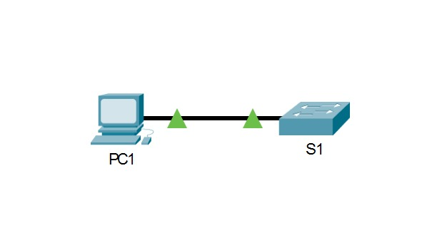
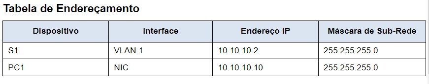
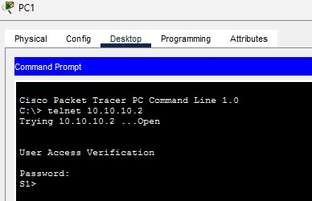
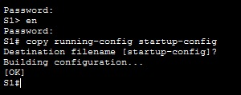
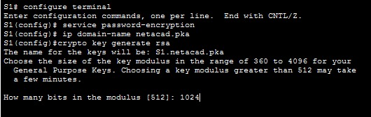
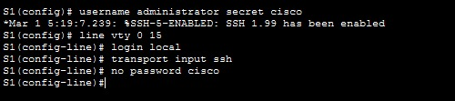
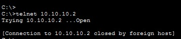
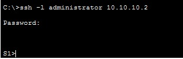
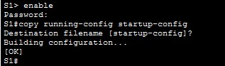

# Cisco Switch SSH Hardening Lab

## Overview

This lab will serve to demonstrate how to secure remote management access to a Cisco switch by replacing insecure Telnet connections with SSH.

This lab was conducted using `Cisco Packet Tracer` and focused on password protection, RSA key generation, local authentication, and SSH connectivity verification.

### Lab Environment

The only components found in this lab are:

Cisco Packet Tracer, Cisco IOS, Ethernet LAN, PC1, Cisco Layer 2 Switch. 
Based on the image below, it shows its current configuration:

The addressing table will also be fundamental for this section.

## Objectives achieved through this lab

- Identify security limitations of Telnet
- Encrypt locally stored passwords
- Configure a domain name on a Cisco switch
- Create a local administrative account
- Configure VTY lines for SSH-only access
- Disable remote telnet access
- Verify SSH connectivity

## The security problem case

Initially, the basis of this lab is that Telnet transmits authentication information and session data without encryption. This makes the protocol inadequate for security administration.

Therefore, the main focus is to replace Telnet with SSH, so that it has encrypted remote management.

### Steps

To make this happen, the ideal first step would be to protect the passwords. To do this, access PC1, enter the `command prompt`, and type `telnet 10.10.10.2`. Using the password, you can access S1, as shown in the image below:

After that, save the current configuration using `copy running-config startup-config`.

This way, you can see that the passwords are encrypted using `service password-encryption`. After that, the next step would be to encrypt communications. To do this, it's necessary to define an IP domain name and generate security keys, using `ip domain-name netacad.pka` as shown in the image below:

I configured this domain name and then used the command `crypto key generate rsa` as can be seen in the same image.

The chosen number of bits in modulus was `1024`, but this was only a requirement of the lab. In more modern environments, more robust key sizes or more developed algorithms should be used, according to current security requirements.

In the next step, I created an SSH user and reconfigured the VTY lines for SSH-only access using `username administrator secret cisco` and then configured the VTY lines to check the local username database to see if there are login credentials and to allow remote access via SSH, removing the password from the existing VTY line. This entire step is illustrated in the image below:

Now, to verify that everything is implemented, I tried accessing it again and it's possible to see that it's closed to foreign hosts, as shown below:

And further checking the part concerning my administrator user, I accessed it with the following command:

And with everything having been successfully executed, I saved the configurations so that everything continues with the same performance and to avoid having to redo the process, as shown below:

---

# Conclusion

This lab experience highlighted the importance of replacing insecure protocols with more reliable alternatives like SSH. It was beneficial for my skills in understanding password protection and RSA key generation, reinforcing fundamental concepts of network security, authentication, cryptography, and secure administration of Cisco devices.