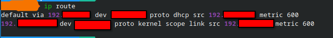
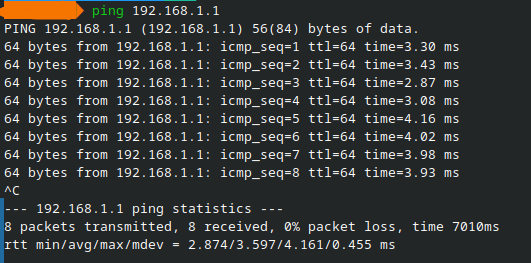
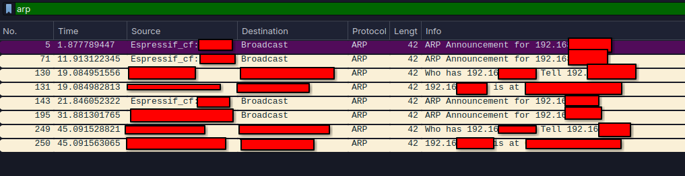

# Wireshark ARP Traffic Analysis Lab

## Objective

The objective of this lab was to capture and analyze ARP traffic using Wireshark, in order to understand how IPv4 addresses are mapped to MAC addresses. I also inspected the local ARP cache using the same tool.
The intention of this lab was also to better understand Wireshark itself and explore its possibilities; however, I will use blurring to maintain the privacy and security of my network and computer.

## Lab Environment

- Operating system: Linux
- Packet Analyzer: Wireshark
- Network Type: Local Area Network (LAN)
- Protocols analyzed: ARP, ICMP, Ethernet II

### Procedure

Initially, the first thing recommended is to check the PC's IPv4 address. Using Linux, the best way to do this is:

`ip route`

This results in a default gateway, usually `192.168.1.1`, and as an example, I'll use `192.168.1.8` as the IPv4 address for the PC.

So, after starting packet capture,

and pinging the default gateway address,

I noticed that filtering by `arp` in Wireshark provides a more in-depth way to observe an ARP request analysis. This allows you to see a raw ARP request being sent when a device knows the IPv4 address of destination but still doesn't know its MAC address, as can be seen in the image.

and as we can also see in the following image, we finally understand how an ARP response analysis works, where the device that has the requested IP address responds with its MAC address.

just as the image shows, it's as if a (fictitious) address `192.168.1.1` is at XX:XX:XX:XX:XX:XX
and unlike the ARP request, the ARP response is normally sent directly to the device that generated the request.

---

## Findings:

This lab study revealed:

- ARP maps Layer 3 IPv4 addresses to Layer 2 MAC addresses
- ARP requests use broadcast frames
- ARP responses typically use unicast communication
- Wireshark allows inspection of Ethernet and ARP headers
- ARP mappings are temporarily stored in the operating system's ARP cache.

## Skills Demonstrated

It is noteworthy that in this lab it was possible to observe:

- Packet capture with Wireshark
- Network traffic analysis
- ARP protocol analysis
- Ethernet frame inspection
- IPv4 and MAC address identification
- Command-line networking tools