## Configuring a client on a wireless router

My goal in this section is to document how I connected devices, configured the wireless router, set up IP addressing, and tested connectivity using Cisco Packet Tracer.

The first thing I did was connect the coaxial cable to the cable splitter; I chose coaxial port 1, clicked on the cable modem, and selected Port 0.

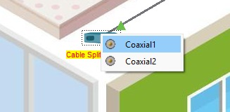 | 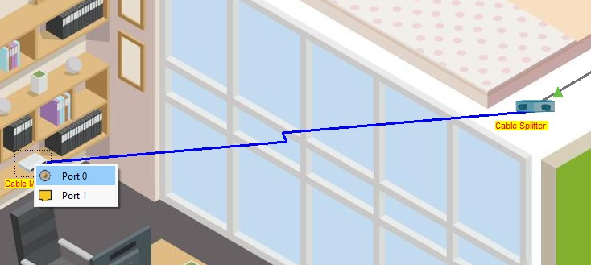

Next, I connected another coaxial cable, this time between the TV and the cable splitter (using coaxial port 2 on the splitter) to verify it was working by checking the TV's "ON" status and viewing the image.

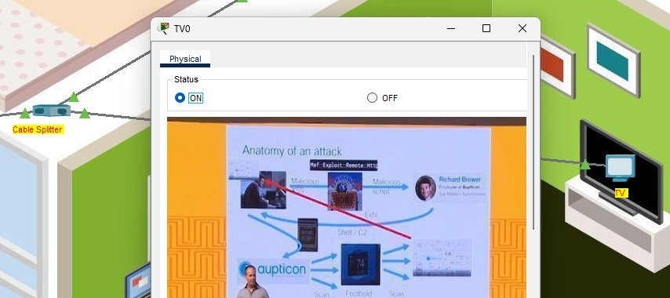

The second step was connecting the modem to the home wireless router (as shown by the top red arrow) and then connecting the home computer to the wireless router (as shown by the middle red arrow).
I selected a copper straight-through cable (indicated by the smallest red arrow at the bottom) and connected it from the cable modem port (Port 1) to the router's Internet port.

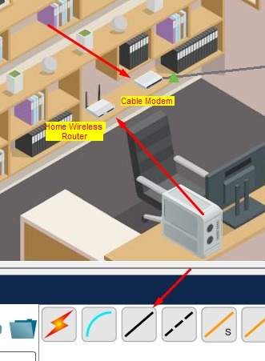

Immediately after, I selected a copper straight-through cable for the computer's FastEthernet0 port and connected it to the wireless router's port (GigabitEthernet1), as shown in the image; the initial network path is now visible via the green arrows.

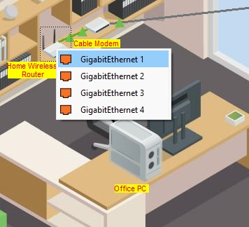 | 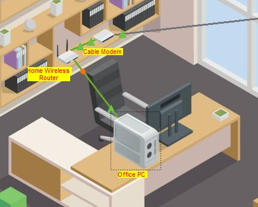

Now for the third stage: configuring the wireless router for wireless connectivity. First, it is important to set up IP addressing; we will use automatic IP configuration. To do this, click on Computer -> Desktop -> IP Configuration.

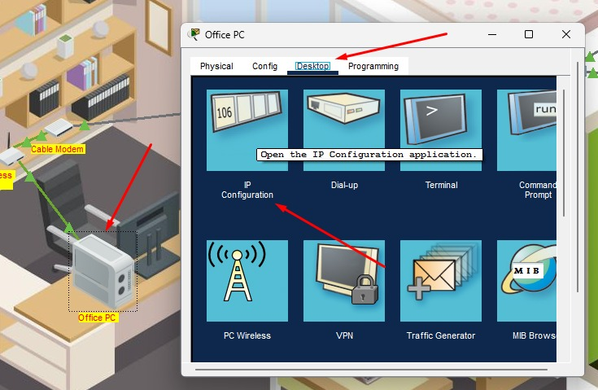

Select DHCP to automatically request IP information from a DHCP server (which is usually configured by default). I noted down the default gateway address

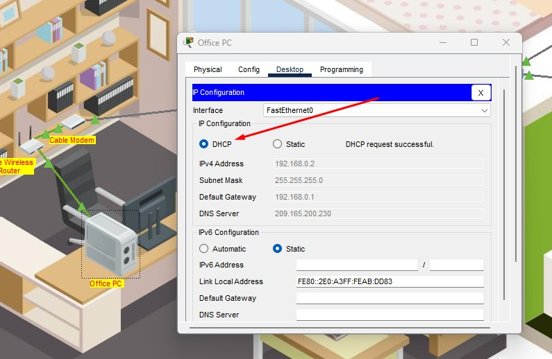

and then opened the web browser, entered the saved address, and selected "GO," which opened the router's default authentication screen
(Note: every router has a factory-default username and password for authentication and configuration, so it is helpful to know the specific model being used in order to have the necessary access information ready)

 | 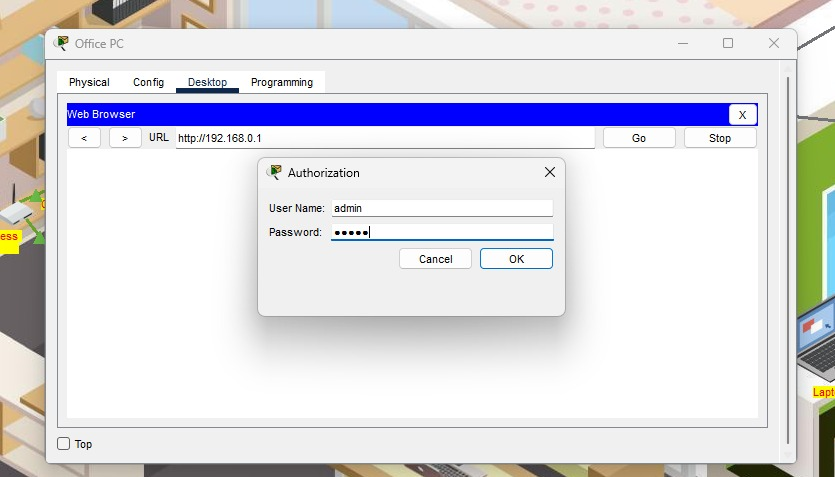

In the fourth step, I had to configure the IP addressing as shown in the image below.

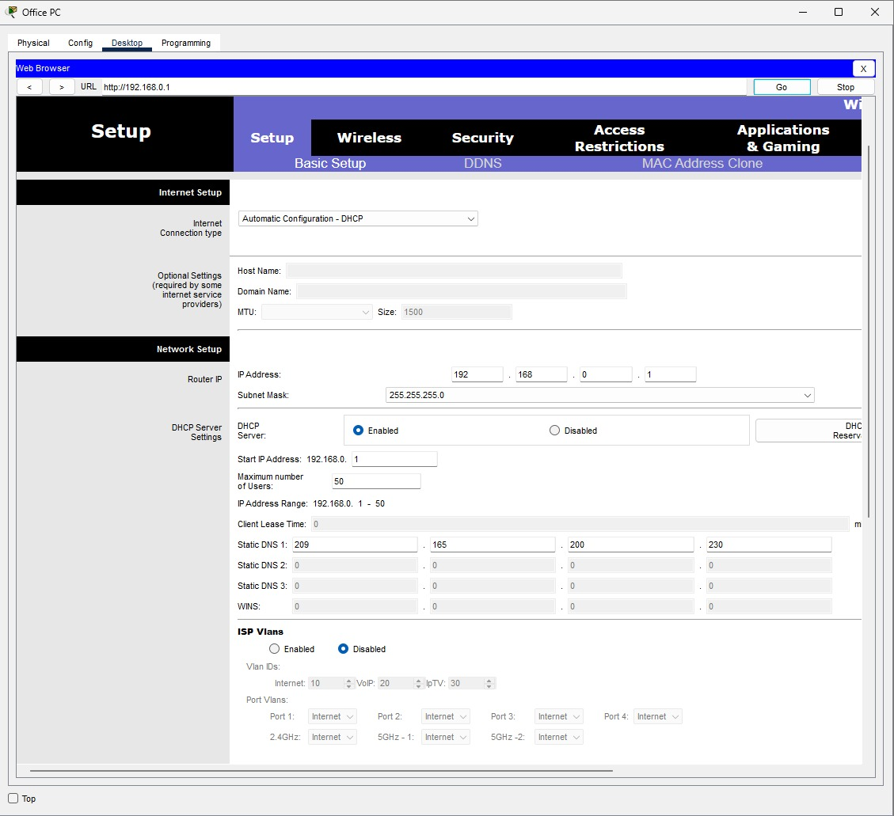

Initially, in the first section (Basic Setup), I configured the network to limit access to just 10 users.

And in the Administration section, I reset the router password to: ********* and then clicked "Save Settings."

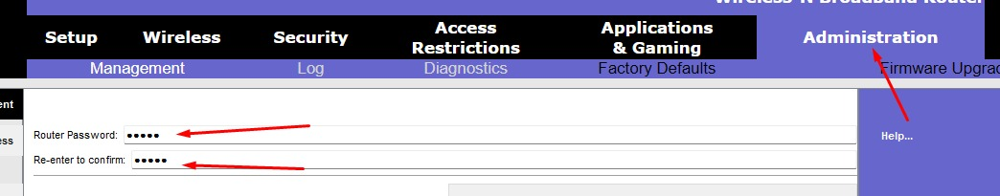

After that, in this sixth step, I demonstrate how I learned to configure the wireless network for wireless devices. To do this, I enabled the network radio for the 2.4GHz network, set SSID Broadcast to "Enabled," and entered "Home" as the Network Name (SSID).

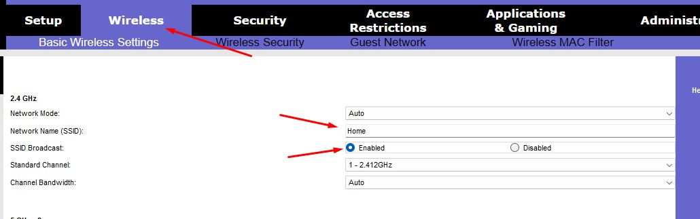

After saving, I went to Wireless Security, selected "WPA2 Personal" as the security mode, and entered a passphrase—using it merely as an example to complete the configuration.

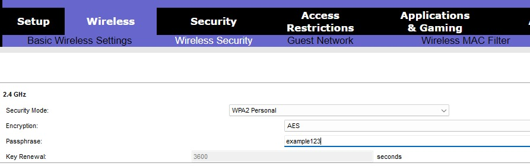

To test if it was working, I connected the laptop: I clicked on the laptop, selected Desktop -> PC Wireless ->

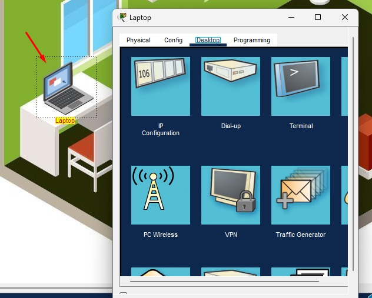

Connect -> Passphrase

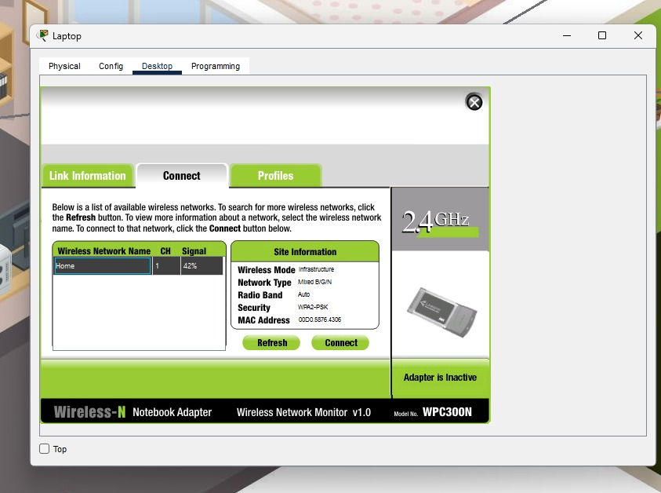 | 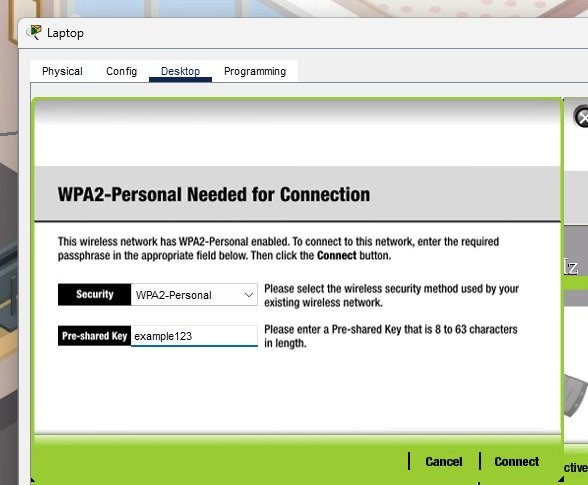

and checked the "Link Information" to see if it was connecting to the access point

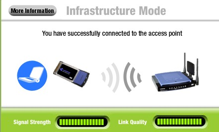

Now, to test the connection, I closed the windows and—still using the laptop—opened the web browser and entered the address "skillsforall.srv." I received the server message "Welcome to Skills For All," thereby demonstrating that I had successfully achieved my goal of connecting to the network.

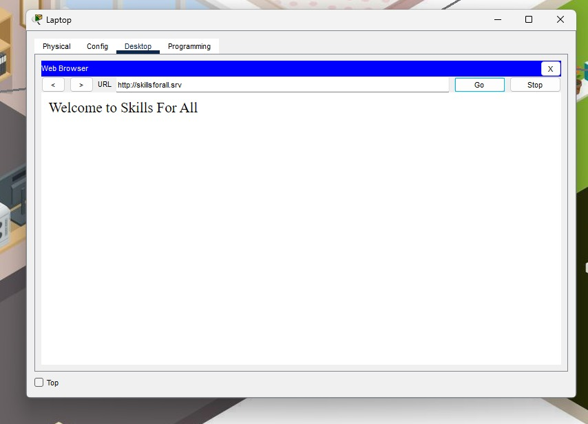

### What I learned from this practical activity:

- Designing and building a network configuration around a specific layout provided insight not only into a home setup but also into how such a system could be implemented in a small business.

- The importance of configuring and changing default router credentials, given that factory-default settings are predictable.

- How security and network configurations must always be tested after implementation to ensure that devices can still communicate with one another.